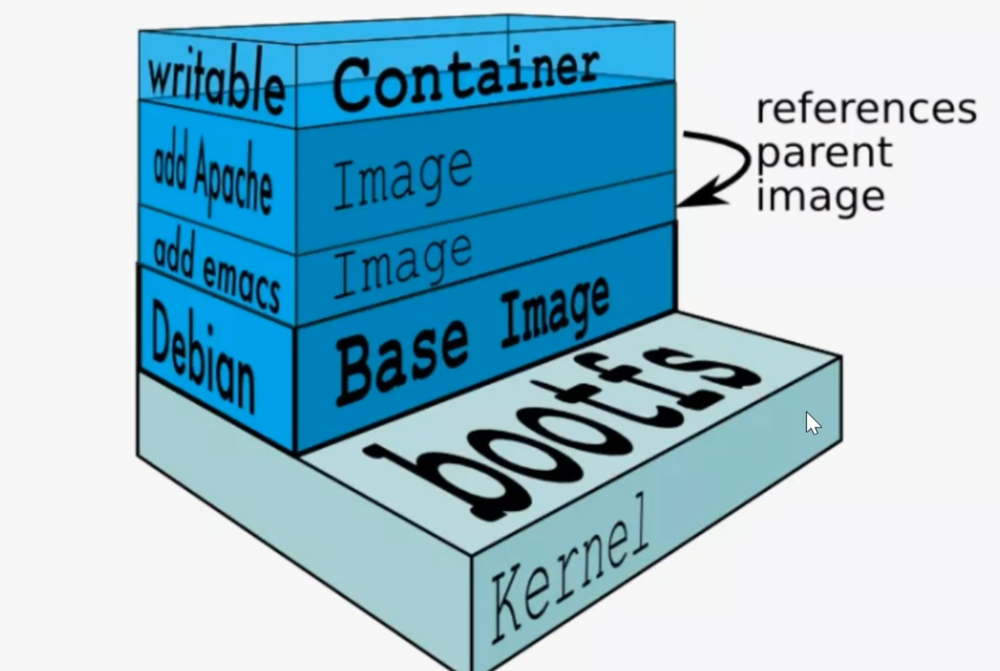
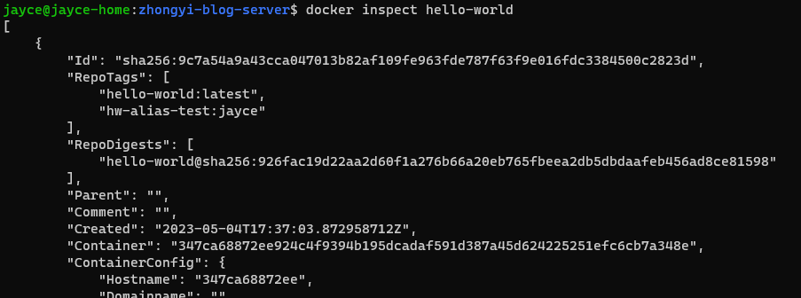
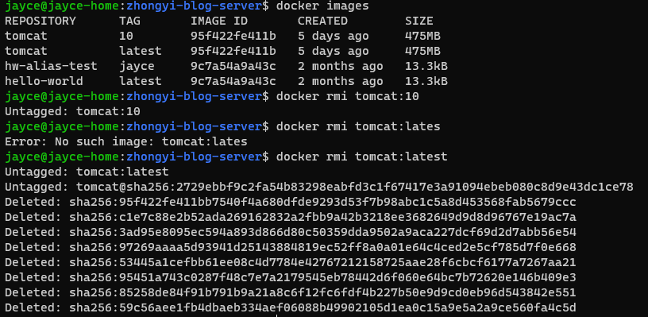
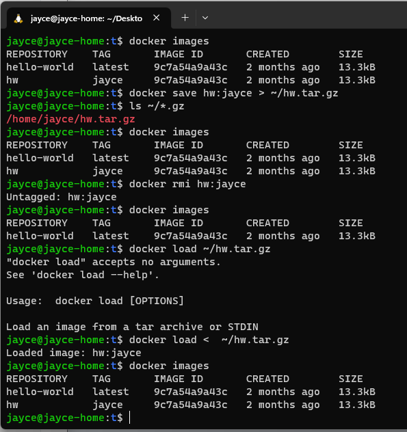

# 5. Docker 镜像实战

- **镜像** 是容器运行的前提， 是 Docker 的核心之一
- **镜像** 的获取方式有两种， 一种是下载别的在镜像仓库种提供好的镜像， 一种是自己导入或制作的镜像。

## 5.1 配置阿里云镜像加速器

 Docker 运行一个容器前许哟本地有对应的镜像， 如果镜像不存在本地， 那么 Docker 会从镜像仓库中去下载， 默认的是从 Docker Hub 公共注册表服务器中去下载：https://hub.docker.com， 但是这个仓库的下载速度实在是太慢了， 我们需要更改成 阿里云的代理镜像仓库，来提速。

```bash
# 进入阿里云容器镜像服务页面，登录
https://cr.console.aliyun.com/cn-hangzhou/instances/mirrors

# 在镜像加速器页面中找到加速器地址
https://p3qezz4l.mirror.aliyuncs.com
# 或者直接用官方加速器地址 https://registry.docker-cn.com

# 在/etc/docker 目录下找到 daemon.json 文件(没有就新建)， 将下面内容写入
{
	“registry-mirrors": ["https://p3qezz4l.mirror.aliyuncs.com"]
}

# 重启daemon 服务
systemctl daemon-reload

# 重启 docker 服务
systemctl restart docker

```


## 5.2 搜索镜像

```bash
docker search tomcat
```


## 5.3 下载镜像

```bash
# 默认是下载最新版本的镜像， 也就是 latest 版本
docker pull tomcat

# 以上命令等价于
docker pull tomcat:latest
```


## 5.4 镜像的分层


docker 一个镜像是由很多个镜像层一层一层叠加起来的。 



这样做的好处是，**共享资源**， 当**不同的镜像**包含了**相同的层**的时候， 本地仅会存储一份内容， 这样以来就减少了存储空间， 例如， 有多个镜像都是从相同的 base 镜像构建而来， 那么本地磁盘只需要保存一份 base 镜像， 同时内存中也只需要加载一份 base 镜像。 就可以为所有容器服务了。


## 5.5 显示本地已有的镜像列表

```bash
# 显示全部镜像
docker images

#按需显示指定镜像信息
docker images tomcat
```

在列出的信息中，有一下几个字段信息：

- REPOSITORY:  来自哪个仓库
- TAG: 镜像的标签，例如 latest 表示最新
- IMAGE ID:  镜像的 id
- CREATED: 镜像的创建时间
- SIZE: 镜像的大小


## 5.6 Tag 标签

镜像的名称实际上有两部分组成， `repository-tag`， 其中 `tag` 一般用于标识版本。  默认是 `latest`.  镜像的名称只是在给一个镜像贴上标签， 在一个镜像上可以贴多个标签。 例如： `tomcat:latest`, `tomcat:10`

给镜像另起一个名字

```bash
docker tag tomcat:latest tomcat:10
```


## 5.7 查看镜像详情

```bash
docker inspect 镜像名
```




## 5.8 导出镜像文件

我们可以把镜像导出为本地文件，然后在需要镜像的其他机器中导入此镜像即可

```bash
# 语法： docker save 镜像名 > 压缩包名

#将 tomcat 镜像导出为 tomcat.tar.gz
docker save tomcat > tomcat.tar.gz

# 导出多个镜像文件
docker save tomcat hello-world > images.tar.gz
```

> 注意指定压缩文件名时如果没有指定路径， 默认会保存文件在当前操作目录中。


## 5.9 删除镜像

在删除镜像时，需要注意的时，只有当镜像只有唯一一个名称时才会删除镜像， 否则只是删除当前的名称，

```bash
# 当前测试
$ docker images
REPOSITORY      TAG       IMAGE ID       CREATED        SIZE
tomcat          10        95f422fe411b   5 days ago     475MB
tomcat          latest    95f422fe411b   5 days ago     475MB
hello-world     latest    9c7a54a9a43c   2 months ago   13.3kB
hw-alias-test   jayce     9c7a54a9a43c   2 months ago   13.3kB
```

```bash
# 语法： docker rmi 镜像名

# 删除名为 tomcat:10 的镜像， 注意： 这里只是删除了 tomcat:10 的一个镜像标签，镜像本身并没有被删除, 这个操作实际叫做 Untag

docker rmi tomcat:10

# 删除 tomcat:latest, 因为时唯一一个名字了， 所以治理才会做最终的删除
docker rmi tomcat:latest
```




## 5.10 导入镜像文件

可以把镜像导出，自然也可以导入

```bash
# 语法： docker load < 压缩包名

docker load < tomcat.tar,gz
```



