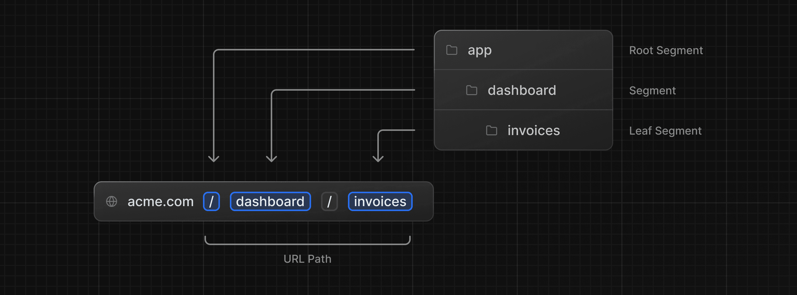

## 创建 Layout 和 页面

学习目标

- 使用 file-system routing
- 理解当创建一个新的路由(段 segments) 的时候，各种目录和文件的作用
- 创建多页面共享的 Layout
- 理解什么是 colocation, partial rendering, 以及 root layout 是什么


### 嵌套路由



`page.tsx` 是一个特殊的 Next.js 文件，它导出一个 React 组件， 表示一个路由页面

`app/page.tsx` 对应的就是首页 `/`

要为 A 路由创建一个嵌套路由 B，可以在 A 所在目录下创建一个名为 B 的目录即可。


### 根Layout （根布局组件）

`/app/layout.tsx` 就是根 Layout, 它是 required ， 被添加到 root layout 中的所有 UI 都会被其他元素共享。 你可以在这里创建根级别路由元素。

此外， 根 Layout 是容纳 `<html>` 根元素的地方。 也就意味着你可以在这里添加一些站点级别的元数据。

Root Layout 组件的定义如下：
```tsx
//...
export default function RootLayout({
  children,
}: {
  children: React.ReactNode;
}) {
  return (
    <html lang="en">
      <body className={`${inter.className}`}>{children}</body>
    </html>
  );
}
//...
```

它是整个站点的入口。 


### 子 Layout

app `/` 根路由下的嵌套子路由下的 `Layout.tsx` 文件的作用其实和 Root Layout 没啥区别。 

Layout 其实就是创建一个基础的画布， 然后留一个 "洞" 给其子页面展示。页面上其他的元素在所有子页面切换展示的时候，始终存在，所以说其他元素都是 “共享的”。


### 创建一个 dashboard

我们要创建一个 dashboard 页面，首先要有一个用于导航的 SideNav 组件，然后就是其他的子页面。 目录结构应该如下：

step1: 创建 dashboard 路由：
```diff
  .
  └── app #/
+    ├── dashboard #/dashboard
+    │   └── page.tsx #dashboard 页面
      ├── layout.tsx # root layout
      └── page.tsx #首页
```

step2: 创建  /dashboard 嵌套路由布局：

```diff
  .
  └── app #/
      ├── dashboard # /dashboard
+    │   ├── layout.tsx # 嵌套布局
      │   └── page.tsx
      ├── layout.tsx # root layout
      └── page.tsx #首页
```

> dashboard/layout.tsx 的核心内容
> ```tsx
> import SideNav from "xxxxxxxxx";
> export default function Layout({ children }: { children: React.ReactNode }) {
>     return (
>         <div >
>             <div >
>                 <SideNav />
>             </div>
>             <div >{children}</div>
>         </div>
>     );
> }
> ```

step3：创建子页面(路由)

```diff
  .
  └── app #/
      ├── dashboard # /dashboard
+     │   ├── customers # /dashboard/customers
+     │   │   └── page.tsx
+     │   ├── invoices # /dashboard/invoices
+     │   │   └── page.tsx    
      │   ├── layout.tsx # 嵌套布局
      │   └── page.tsx #dashboard 首页
      ├── layout.tsx # root layout
      └── page.tsx #首页
```

