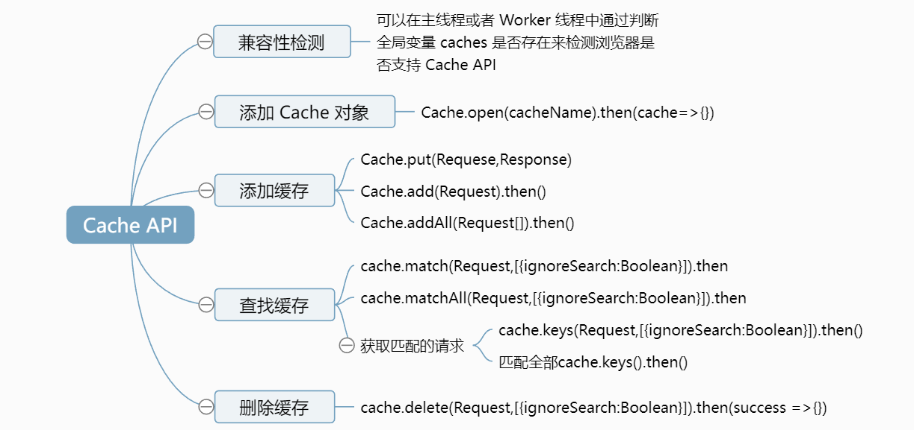

[toc]

## 1. Cache API

在上一节 Fetch API 的介绍当中提到， Fetch API 提供了 Request、Response 等偏底层的类对象， 这样就能以统一的形式将资源的请求与响应过程应用到更多的场景中。 本节所介绍的 Cache API 就属于另一种资源请求与响应的场景， Cache API 提供了一系列的方法实现了请求响应对象的缓存管理，因为它可以作为 资源请求响应的缓存仓库， 为Service Worker 实现离线缓存提供基础支持。

接下来将介绍 Cache API 的使用方法。


## 2. 兼容性检测

我们可以在主线程或者 Worker 线程中通过判断  全局变量 `caches` 是否存在来检测浏览器是否支持  Cache API:

```javascript
if ('caches' in self){
    console.log('当前环境支持 Cache API')
}
```

## 3. 打开 Cache 对象

通过 `cache.open()` 方法可以打开一个 Cache 对象，其语法为：
```javascript
caches.open(cacheName).then(cache=> {/* 获得 Cache 对象 */})
```

其中参数 cacheName 表示要打开的 Cache 对象的名称。 该方法是异步方法，返回的 Promise 对象在 resolve 时会返回成功打开的 Cache 对象。 打开 Chrome 开发者工具， 切换到 Application - Cache Storage 选项卡可以观察到， **在执行 `caches.open()` 方法时， 会在  Cache Storage 下面建立同名仓库**，每个仓库里面的内容就是操作对象的 Cache 对象后写入的资源缓存。 


## 4. 添加缓存

Cache 对象提供了 `put()`、`add()`、`addAll()` 三个方法来添加或者覆盖资源请求响应的缓存。需要注意的是， **这些添加缓存的方法只会对 GET 请求起作用**

### 4.1 `Cache.put(request,response)`

资源请求响应在通过 Cache API 进行存储的时候，会以请求的 Request 对象作为键， 响应的 Response 对象作为值， 因此 `put()` 方法需要依次传入资源的请求和响应对象，然后生成键值对，并缓存起来。 下面举例说明它的使用方法：
```javascript
// 假设 cache 由caches.open('v1') 打开
cache.put(
  new Request("/data.json"),
  new Response(JSON.stringify({ name: "lilei" })),
);
```

这样就给 v1 仓库写入了 '/data.json' 请求与响应的缓存。 通过开发者工具可以明显地看到仓库当中新增的缓存条目信息：


同样，我们可以结合 Fetch API 来获取并存储服务端所返回的资源：

```javascript
fetch('/data.json').then(response => {
    if (response.ok) {
        cache.put(new Request('/data.json'), response)
    }
})
```

在 Fetch API 的章节中，介绍了 Request 和 Response 都基于数据流实现， 因此在进行缓存的是偶需要格外留意 Response 对象的响应体数据是否已经被读取。

### 4.2 `Cache.add(request)` 和 `Cache.addAll(request)`

**`add()` 和 `addAll()` 方法的功能类似于 Fetch API 结合 `put()` 方法实现对服务端资源的抓取和缓存。**

`add()` 和 `addAll()` 的区别在于， `add()` 只能请求和缓存一个资源，而 `addAll()` 能够抓取并缓存多个资源。 有了这两个方法，缓存服务端资源将会变得更加简单：

```javascript
cache.add('/data.json').then(()=>{/* 缓存成功 */})
cache.addAll(['/data.json','/info.txt']).then(()=>{/* 缓存成功 */})
```

## 5. 查找缓存

`cache.match()` 和 `cache.matchAll()` 可以实现对缓存的查找。其中`match()` 会返回第一个匹配条件的缓存结果，而 `matchAll()` 则会返回所有满足匹配条件的缓存结果。 下面举例说明如何查找 "/data.json" 的缓存资源，相关代码如下所示：

```javascript
// 使用 match() 进行查找、
cache.match('/data.json').then(response=>{
  if(response == null){
    // 没有匹配到任何资源
  }else{
    // 成功匹配资源
  }
})

// 使用 matchAll() 进行查找
cache.matchAll('/data.json').then(responses=>{
  if(!responses.length){
    // 没有匹配到任何资源
  }else{
    // 成功匹配到资源
  }
})
```

上述查找方法可以传入第二个参数来控制匹配过程，比如设置 ignoreSearch 参数，会在匹配过程中忽略 URL 中 Search 部分，下面通过代码举例说明这一匹配过程：

```javascript
// 假设缓存的请求 URL 为 /data.json?v=1
caches.match('/data.json?v=2', { ignoreSearch: true }).then(response=>{
  // 匹配成功
})
```

## 6. 获取匹配的请求

前面介绍的 `match()`， `matchAll()` 方法会返回匹配到的响应，但是如果需要获取匹配到的请求，可以通过 `cache.keys()` 方法实现：

```javascript
cache.keys('/data.json',{ignoreSearch:true}).then(requests=>{
    // requests 可能包含 /data.json、/data.json?v=1、/data.json?v=2 等等请求对象
    // 如果匹配不到任何请求，则返回空数组
})
```

如果没有传入任何参数，`cache.keys()` 会默认返回当前 Cache 对象中缓存的全部请求：

```javascript
cache.keys().then(requests => {
    // 返回全部请求对象
})
```


## 7. 删除缓存

通过 `cache.delete()` 方法可以实现对缓存的请求。 其语法如下所示：

```javascript
cache.delete(request,options).then(success => {
    // 通过 success 判断是否成功
})
```

比如要删除前面添加成功的 `/data.json` 请求，相关代码如下所示：
```javascript
cache.delete('/data.json').then(success => {
    // 将打印 true， 代表删除成功
    console.log(success)
})
```

假如删除一个未被缓存的请求，则执行删除后返回的 success 为 false:

```javascript
cache.delete('/no-cache.data').then(success => {
    // 将打印 false, 代表删除失败
    console.log(success)
})
```

在调用 `cache.delete()` 的时候，可以传入第二参数去控制删除操作中如何匹配缓存，其格式与 `match()` 、`matchAll()` 等匹配方法的第二参数一致，因此下面举例的删除过程能够忽略 Search 参数：

```javascript
// 假设缓存的请求 URL 为 /data.json?v=1.0.1
// 那么设置 ignoreSearch 之后同样也会删除该缓存
cache.delete('/data.json', { ignoreSearch:true }).then(sucess => {
  // data.json?v=1.0.1 已经被成功删除
})
```


## 小结




