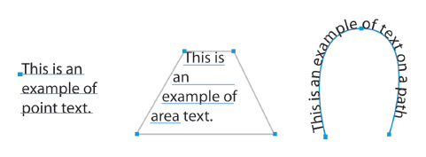
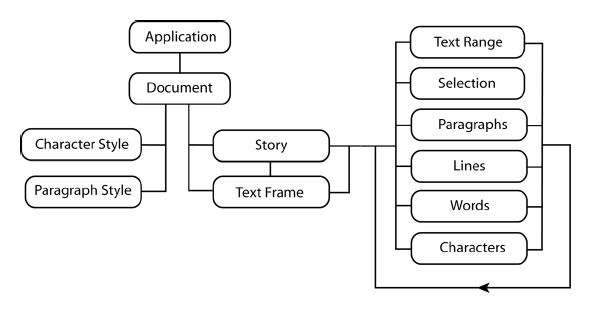

# Text Objects

当你在AI 中输入文字的时候， 就会自动的创建 `text frame` 对象。同时还会创建一个  story object.

## Text Frames (文本帧)

有三种类型的文本帧：

- point
- area
- path



想要创建特定类型的文本帧， AppleScript 可以通过使用 `text frames` 对象的 `kind` 属性。 JavaScript / VBScript 中的 `text frames` 对象则包含了对应的方法。

> As in the Illustrator application, you can thread area or path text frames.
> To thread existing text frames, use the `next frame` or `previous frame` property of the `text frame` object.
> Threaded frames make a single `story` object.
>
> @jayce: 不是特别明白说的什么意思
>
> thread 怎么理解的？ 

## Text Geometry （文本几何）

> 在设计软件（例如Adobe Illustrator、Photoshop）或计算机图形学中，Text Geometry 的概念经常涉及到以下几个方面：
>
> 1. **位置：** 文本在画布或图像中的位置，通常由坐标（x、y）表示。
> 2. **大小：** 文本的字体大小，通常以磅（point）为单位。
> 3. **旋转：** 文本的旋转角度，描述文本相对于水平或垂直方向的旋转。
> 4. **边界框：** 文本周围的矩形框，用于确定文本占用的空间区域。
> 5. **行高：** 区域文本的行与行之间的垂直间距。
> 6. **字符间距和行间距：** 字符之间和行之间的水平间距。

尽管这三种文本框具有共同的特征，比如方向(orientation)，但每种都具有特定类型的特质，会在 `text frame` 对象的属性中所反映。例如：

- 区域文本框可以具有行和列，你可以通过行计数(`row count`)和列计数(`column count`)属性进行访问。
- 路径文本具有起始 T 值（`start T`）和结束 T 值（`end T`）属性，指示文本在路径上的起始和结束位置。

区域和路径文本框与文本路径对象相关联，可以通过 `text frame` 对象的文本路径属性指定。文本路径  (`text path`)  定义了文本框在画板上的位置和方向（水平或垂直）（而 `text frame` 对象的方向属性则定义了文本框内文本的方向）。对于点文本，文本路径属性无效，因为点文本的位置和方向完全由文本框本身的属性定义。


## Objects that represent text content (文本内容对象)

在一个 `text frame` 或者 一个  `story` 中， 实际的文本内容可以下列的任务对象访问：

- `characters`
- `words`
- `paragraphs`
- `lines`

一个 `line`  对象是指 在一个  `text frame` 或者 `story` 对象中，一行中所有的字符

所有的  text-art items 都至少会有一行的文本，被定义为一个 `line` 对象。

如果文本内容包含了 折行(hard line break)，或者文字溢出 text art 的宽度， Text art 将会有多行 文本行。

Text objects 可以在 `text frame` 和  `story` 对象中的集合所访问和标识 (accessed and identified);例如：

```js
textFrame("My Text Frame").paragraphs
// or
story("My Story").paragraphs
```



`text frame` 和 `story` 对象都有  `insertion point` 和 `text selection` 属性。

`text frame`对象属性也包含有 text frame 的一些特性， 例如：

- frame 的 `with`, `height`, `position`
- frame 的 `hidden` 以及 `locked` 状态
- 以及文本是否 `editable`

> :notebook: 不能通过脚本创建 `line` 对象，但是可以创建 `character`, `paragraph`, 和 `word` 对象


## Text ranges

一个  text frame 或者 story 中的众多 text 对象， 同样也会被 `text range` 对象集体表示。 例如，一个字符的 text range 长度就为1， 一个 单词的 text range 的长度则是由单词前的空格划分。 你可以通过 `contents` 属性来设定一个 text range 对象的内容。 


## Text styles

Text-style elements, 例如 `font`, `capitalization`, `justification` 通过  `paragrph attribute` 和  `character attribute` 对象来表示。

这些属性对象从属于 `paragraph style` 和 `character style` 对象。

这两个对象允许你在脚本通过调用 `apply to ` 和 `remove` 方法来应用或者移除 某个特定的paragraphj, character, 或者 text range 的属性。 

你可以在 text 或者 paragraph 层面，通过 applying 一个样式，或者提供一个 属性的 local 的 overrides 来该表一个 text range 的展示属性：

- character 样式对象被应用于由一个或者多个字符所组成的集合，可以用纸字符特性，例如像 `font`, `aligment`, `leading`, `language`, 以及 `capitalization`， 这些都是 `character attribute` 对象中的属性。
- `paragraph style` 对象应用于段落，可以用于控制落的特性，例如 `first line indent`, `left indent`, `right indent`, 这些是 `paragraph attribute` 对象的属性。


