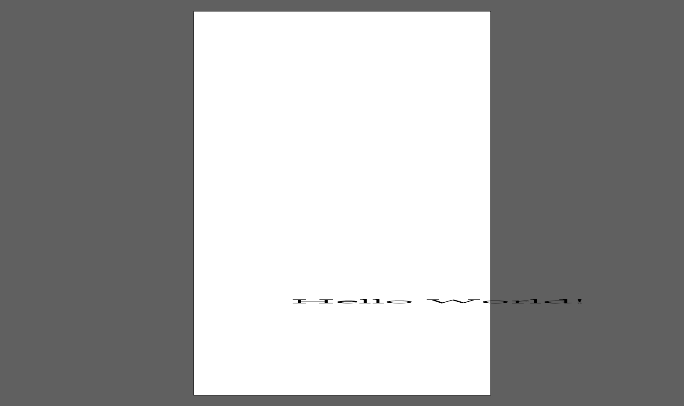

# Hello World

在这个例子中，你创建一个新的 Illustrator 文档，然后添加一个包含这个信息的文本框。按照以下步骤进行操作：

要了解如何找到 ExtendScript Toolkit，请查看查看 [Viewing the JavaScript object model](/ai-script_learn/note/1.Introduction/4.查看对象模型).。

1. 使用任何文本编辑器（包括 Adobe InDesign® 或 ESTK），输入以下文本：

   ```js
   //Hello World!
   var myDocument = app.documents.add();
   //Create a new text frame and assign it to the variable "myTextFrame"
   var myTextFrame = myDocument.textFrames.add();
   // Set the contents and position of the text frame
   myTextFrame.position = [200,200];
   myTextFrame.contents = "Hello World!"
   ```

2. 为了测试这个脚本，你可以选择以下任一方式：

   - 如果使用ESTK，请在左上角的下拉列表中选择“Adobe llillustrator CC 2017”，选择“是”启动Illustrator，然后在ESTK中选择“调试>运行”运行脚本。
   - 如果您使用的是与ESTK不同的文本编辑器，请将文件保存为纯文本，并将文件扩展名为.jsx，然后启动Illustrator。在Illustrator中，选择文件>脚本>其他脚本，然后导航到并运行脚本文件。

   > :tipping_hand_man: 将脚本添加到 Illustrator 的脚本菜单（文件 > 脚本），请将脚本保存在脚本文件夹中。下次启动 Illustrator 时，脚本将出现在菜单上。有关详细信息，请参阅[Installing scripts in the Scripts menu](https://ai-scripting.docsforadobe.dev/introduction/executingScripts.html#introduction-executingscripts-installing).


## 加点料

接下来，我们创建一个新的脚本，对你用第一个脚本创建的 Illustrator 文档进行更改。我们的第二个脚本演示了如何：

1. 获取当前文档。
2. 获取当前文档的宽度。
3. 将文本框的大小调整为文档的宽度。

如果你已经关闭了 Illustrator 文档，请再次运行你的第一个脚本以创建一个新的文档。按照以下步骤进行操作：

1. 在脚本编辑器中，选择文件 > 新建以创建一个新的脚本。

2. 输入下面的代码内容：
   ```js
   var docRef = app.activeDocument;
   var docWidth = docRef.width
   var frameRef = docRef.textFrames[0]
   frameRef.width = docWidth
   ```

3. 运行脚本

