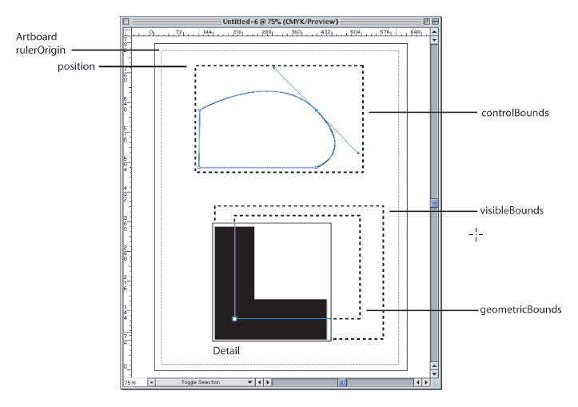

# Page-item 定位 和 尺寸

在 Illustrator 中，使用简单的 **二维几何形状** 来记录页面元素对象的位置。文档中的每个页面元素对象都有一个位置属性，用以定义一个固定点，即以 **[x，y] 格式**表示的页面坐标对。这个固定点是对象边界框的左上角。

关于页面项集合的组成对象类型的信息，请参阅 “The artwork tree”。

一个点由一对坐标指定：水平位置 x, 垂直位置 y

在 Illustrator 中选择或创建对象时，可以在信息面板中看到这些坐标。

对于画板而言，(0,0) 是默认的坐标原点，即左上角，体现在画板对象的标尺原点属性中。X 坐标值从左到右增加，而 Y 值从上到下增加。这在 CS5 版本中发生了改变；为了保持脚本兼容性，由脚本创建的文档仍然使用旧系统，原点位于画板的左下角，Y 值从下到上增加。文档对象的页面原点属性定义了文档可打印区域的左下角作为固定点。

每个页面元素对象都有宽度和高度属性。页面元素的宽度或高度允许的最大值是 16348 点。

## 艺术条目边界 Art item bounds

每个页面项(`page item`)对象都有三个属性，它们使用固定的矩形来描述对象的总体范围:

页面元素的几何边界 (geometric bounds) 是指对象的边框的矩形尺寸，不包括描边宽度。
可见范围 (visible bounds) 是指页面元素的尺寸，包括描边的宽度。
控制范围 (control bounds) 定义了对象的矩形尺寸，包括内部和外部控制点。
下图使用 JavaScript 命名约定来说明这些属性。

