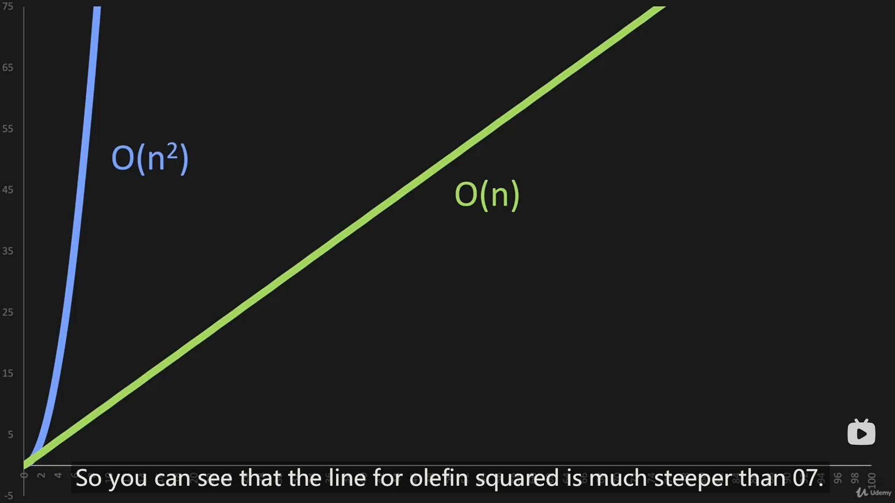

```python
def print_items(n):
    for i in range(n):
        for j in range(n):
            print(i,j)

print_items(10)
```


When we have a loop inside of a loop. we can describe this as `O(n^2)`


```python
def print_items(n):
    for i in range(n):
        for j in range(n):
            for k in range(n):
                print(i,j,k)

print_items(10) 
```


the same way , we can describe this situation as `O(n^3)`, but however, we can simplify this to `O(n^2)`, so We can simplify O(n^3), O(n^10), and O(n^100) to O(n^2) regardless of how many layers of nesting or the magnitude of their exponents.

> "the magnitude of their exponents" 意指这些指数的数值大小或幅度。在这种上下文中，它表示指数的数值有多大。



> `O(n^2)` 和 `O(n)` 的英文翻译分别是 "O of square", "O of n".

We can observe that the 'O(n^2)' curve is significantly steeper than 'O(n)', indicating considerably lower efficiency in terms of time complexity.