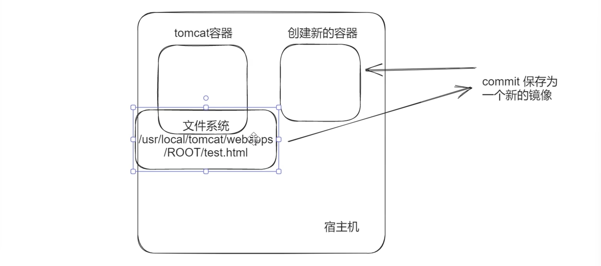

# Commit 命令

Docker 提供了一个比较特殊的命令 `commit`，该命令可以将设置好的**容器数据（配置信息等）**状态保存为一个新的**镜像**， 语法 ： `docker commit 镜像名/id 新镜像名`




1. 启动一个 新的 Tomcat 容器

   ```bash
   docker run -d -p 8080:8080 tomcat03
   ```

2. 进入容器， 在 /usr/local/tomcat/webapps 下创建 ROOT 目录

   ```bash
   # 进入容器
   docker exec -it tomcat03 -it bash
   
   cd /usr/local/tomcat/webapps
   mkdit ROOT
   exit
   ```

   

3. 将宿主机的 /mydata/tomcat/test.html 文件复制到容器中

   ```bash
   docker cp /mydata/tomcat/test.html tomcat03:/usr/local/tomcat/webapps/ROOT/test.html
   ```

4. 访问 `宿主机ip: 隐射的宿主机端口/test.html` 测试

5. 使用 `commit` 命令保存修改后的容器作为新的镜像

   ```bash
   docker commit tomcat03 my_tomcat
   # 或者
   docker commit tomcat03 my_tomcat:latest
   ```

6. 从新镜像中启动容器

   ```bash
   # 停止并删除之前的容器
   docker rm -f tomcat03
   
   # 从保存的新镜像中启动容器
   docker run -d -p 8080:8080 my_tomcat
   ```

7. 再次访问 `宿主机ip: 隐射的宿主机端口/test.html` 测试