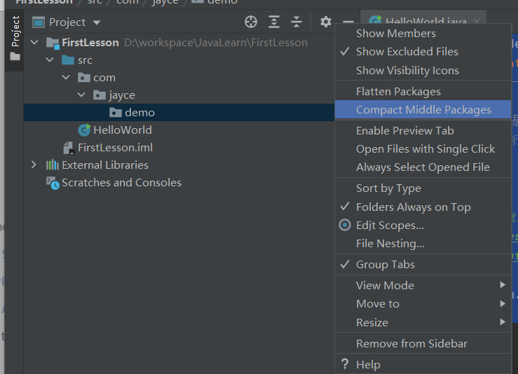

[toc]

## 1. 注释、标识符、关键字；

**1.1 注释**

Java中的注释分为三种：

- 单行注释
- 多行注释
- 文档注释

```java
public class HelloWorld {
    public static void main(String[] args) {
        //这是一个单行注释
        /*
            这是一个
            多行注释
        */

        /**
         * 这就是文档注释
         * @Description HelloWorld
         * @Author Jayce sun
         */
        System.out.println("HelloWorld!");
    }
}
```

**文档注释：**

JavaDoc 命令是用来生成自己API文档的

```java
package com.jayce.javaDoc;


//这里的类文档注释是手写的
/**
 * @author jayce
 * @version 1.0
 * @since jdk1.8
 */
public class javaDoc {
    String name;

    
    //函数这里的文档注释是按下`/** + enter` 后自动生成的
    /**
     *
     * @param name
     * @return
     * @throws Exception
     */
    public String test(String name) throws Exception{
        return name;
    }
}

```

文档注释能够写的所有参数如下：

- `@author` 作者名
- `@version` 版本号
- `@since` 指明需要最早使用的jdk版本
- `@param` 参数名
- `@return` 返回值情况
- `@throws` 异常抛出情况

> 注释的位置在类上面，就是，类注释，在函数上面就是函数注释。 

使用javaDoc命令生成文档

```bash
$ javadoc -encoding UTF-8 -charset UTF-8 javaDoc.java
```

> 


**1.2 标识符** 

Java 所有的组成部分都需要名字。 类名、变量名以及方法名都被称为标识符。

标识符的特点：

- 大小写敏感；
- 以字母 或 `$` 或 `_` 开头；

**关键字：** 不能被用户使用的Java语言本身所占用的字符集合。


| [abstract](https://baike.baidu.com/item/abstract)     | [assert](https://baike.baidu.com/item/assert)             | [boolean](https://baike.baidu.com/item/boolean)     | break                                                 | [byte](https://baike.baidu.com/item/byte)     |
| ----------------------------------------------------- | --------------------------------------------------------- | --------------------------------------------------- | ----------------------------------------------------- | --------------------------------------------- |
| case                                                  | [catch](https://baike.baidu.com/item/catch)               | [char](https://baike.baidu.com/item/char)           | [class](https://baike.baidu.com/item/class)           | const                                         |
| continue                                              | [default](https://baike.baidu.com/item/default)           | [do](https://baike.baidu.com/item/do)               | [double](https://baike.baidu.com/item/double)         | [else](https://baike.baidu.com/item/else)     |
| [enum](https://baike.baidu.com/item/enum)             | [extends](https://baike.baidu.com/item/extends)           | [final](https://baike.baidu.com/item/final)         | [finally](https://baike.baidu.com/item/finally)       | float                                         |
| [for](https://baike.baidu.com/item/for)               | goto                                                      | [if](https://baike.baidu.com/item/if)               | [implements](https://baike.baidu.com/item/implements) | [import](https://baike.baidu.com/item/import) |
| [instanceof](https://baike.baidu.com/item/instanceof) | [int](https://baike.baidu.com/item/int)                   | [interface](https://baike.baidu.com/item/interface) | long                                                  | native                                        |
| new                                                   | [package](https://baike.baidu.com/item/package)           | [private](https://baike.baidu.com/item/private)     | [protected](https://baike.baidu.com/item/protected)   | [public](https://baike.baidu.com/item/public) |
| [return](https://baike.baidu.com/item/return)         | [strictfp](https://baike.baidu.com/item/strictfp)         | [short](https://baike.baidu.com/item/short)         | [static](https://baike.baidu.com/item/static)         | [super](https://baike.baidu.com/item/super)   |
| [switch](https://baike.baidu.com/item/switch)         | [synchronized](https://baike.baidu.com/item/synchronized) | [this](https://baike.baidu.com/item/this)           | [throw](https://baike.baidu.com/item/throw)           | throws                                        |
| [transient](https://baike.baidu.com/item/transient)   | try                                                       | [void](https://baike.baidu.com/item/void)           | [volatile](https://baike.baidu.com/item/volatile)     | [while](https://baike.baidu.com/item/while)   |

> "关键字" 和 “标识符” 的概念区分：
>
> *标识符*是允许作为变量(函数、类等)名称的有效字符串。其中,有一部分是*关键字*(语言本身保留的*标识符*)

## 2. 数据类型

Java中的数据类型分为两个大类：

```mermaid
graph LR
	Java数据类型 --> A[基本类型primitive type] & B[引用类型reference type]
	A --> AA[数值类型] & AB[Boolean类型]
	AA --> AAA[整数类型] & AAB[浮点类型] & AAC[字符类型]
	AAA --> byte_1字节_-128-127
    AAA --> short_2字节_-32768-32767
    AAA --> int_4字节_-2147483648-2147483647
    AAA --> long_8字节_-9223372036854775808-9223372036854775807
    
    AAB --> float_4字节 & double_8字节
	AAC --> char_2字节
	AB --> 占一位且只能为true或者false
	B --> 类 & 接口 & 数组
	
	
```


## 3. 类型转换

## 4. 变量、常量

## 5. 运算符

## 6. 包机制、JavaDoc

为了更好的组织类，Java 提供了包机制，用于与别类名的**命名空间**


> 老师的类比解释
>
> “包的本质就是文件夹”

包语句的语法格式为：

```java
package pkg1[.pkg2[.pkg3...]];
```

<span style="color:red">**一般利用公司域名倒置作为报名**</span>

例如：

```
com.baidu.baike
com.baidu.www
com.baidu.wenku
...
```


示例：

邮件src - new - Package - "com.jayce.demo" 

```java
package com.jayce.demo;

public class HelloWorld {
    public static void main(String[] args) {
        //这是一个单行注释
        /*
            这是一个
            多行注释
        */

        /**
         * 这就是文档注释
         * @Description com.jayce.demo.HelloWorld
         * @Author Jayce sun
         */
        System.out.println("com.jayce.demo.HelloWorld!");
    }
}
```

> 首行在拖入后，将会自动标注当前包路径

> :warning: 注：
>
> 如果没有自动展开，Idea中需要去掉该勾选项
>
> 


为了能够使用某一个包的成员，我们需要在Java程序中明确导入该包。 使用`import` 语句可以完成此功能：

```java
package com.jayce.demo;

import java.util.Date;

public class HelloWorld {
    public static void main(String[] args) {
        System.out.println(new Date());
    }
}
```

如果需要导入一个包下的所有类：

```java
import com.jayce.demo.*;
```


> 规范很重要，更加详尽的规范 可以参考 《阿里巴巴java开发手册》
