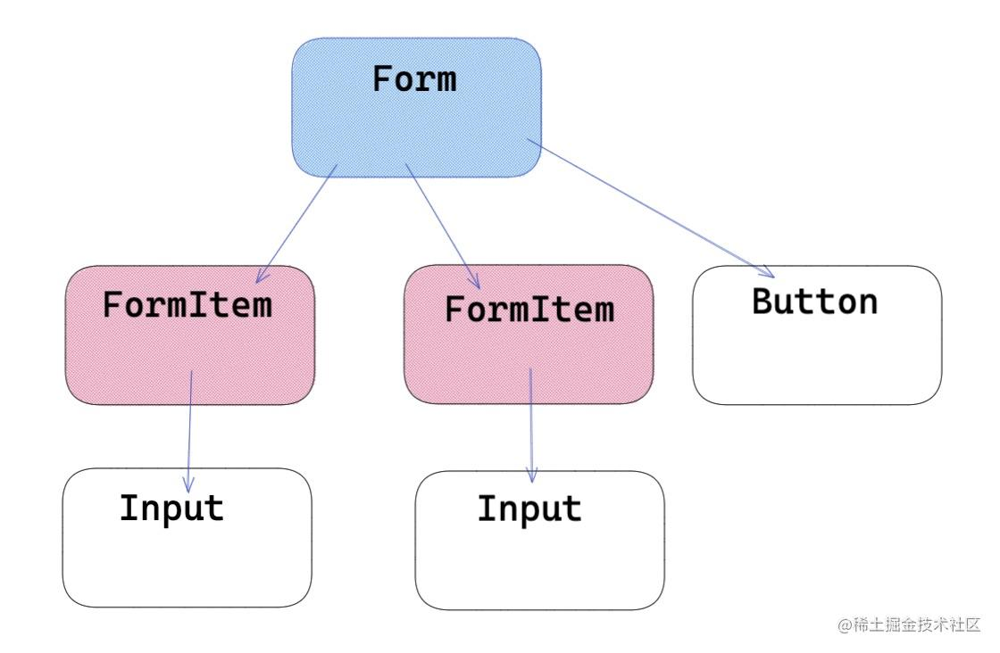
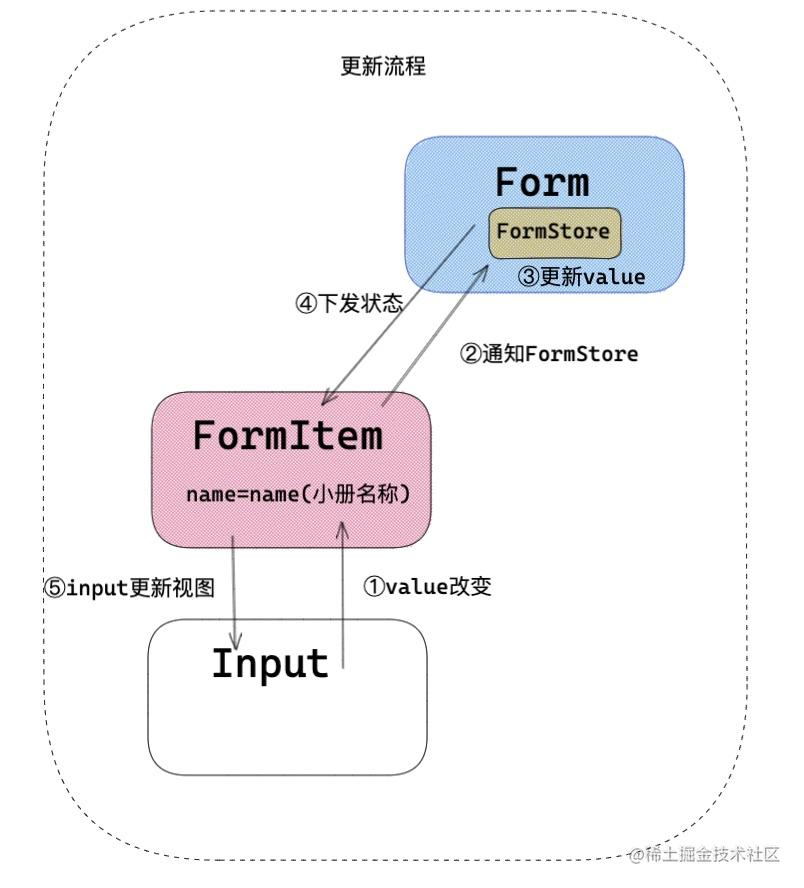
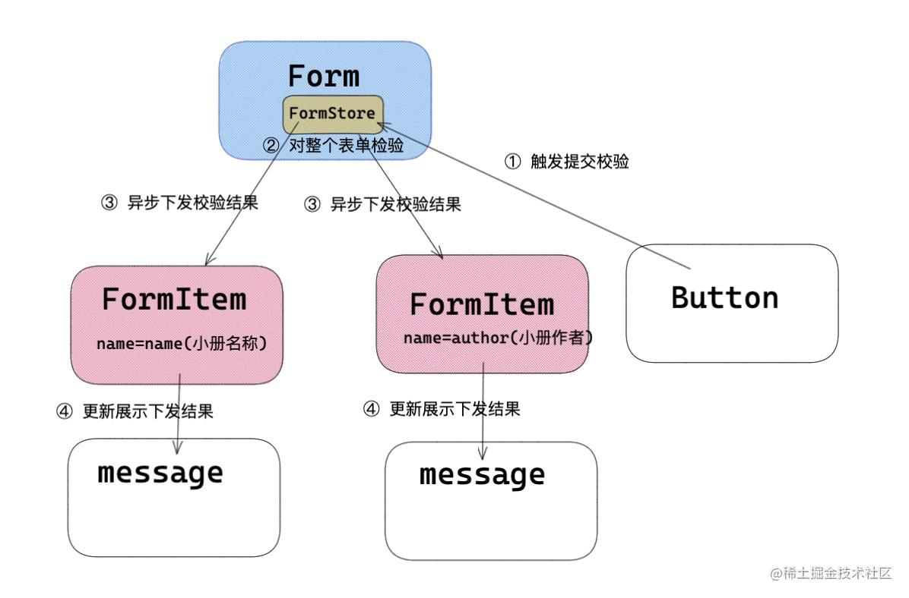

## 一 前言

验证表单的设计，一直是比较复杂棘手的问题，难点在于对表单数据层的管理，以及把状态分配给每一个表单单元项。本章节来实现一套表单验证系统，通过本章节的学习，读者能够掌握以下知识点：

* 表单控件组件设计。
* 建立表单状态管理，状态分发，表单验证。
* 自定义 hooks —— `useForm` 编写。
* `Form` ，`FormItem` 如何建立关联，协调管理表单状态。

由于表单验证章节内容过多，分为上下两个章节来介绍。

* 本章节主要介绍表单系统的设计思路和表单状态管理 `FormStore` 的实现。
* 下章节将介绍 Form 和 FormItem 的编写，以及功能验证。 

## 二 设计思路

可能开发者平时使用验证表单控件感觉挺便携方便的，那是因为在整个表单内部，已经为开发者做了大部分的‘脏活’，‘累活’，一个完整验证表单体系实际是很复杂的，整个流程可以分为，**状态收集** ，**状态管理** ，**状态验证** ， **状态下发** ，等诸多环节，所以在开发一套受宠于大众的表单控件，首先每一个环节设计是蛮重要的。接下来首先介绍一下，如何设计一套表单系统。

在设计之前，拿 antd 为例子，看一下一个基本的表单长什么样子 （ 可以称之为 `Demo1` ） ：

````js
<Form  onFinish={onFinish} >
   <FormItem name="name"  label="小册名称" >
       <Input />
   </FormItem>
    <FormItem name="author"  label="小册作者" >
       <Input />
   </FormItem>
   <Button htmlType="submit" >确定</Button>
</Form>
````

### 1 表单组件层模型设计

如上，一套表单系统分为 Form ，FormItem ，表单控件三部分构成，下面一一介绍三个部分作用以及应该如何设计。

`Form` 组件定位以及设计原则：

* **状态保存**： `Form` 的作用，管理整个表单的状态，这个状态包括具体表单控件的 value，以及获取表单，提交表单，重置表单，验证表单等方法。
* **状态下发**： `Form` 不仅仅要管理状态，而且还要下发传递这些状态。把这些状态下发给每一个 FormItem ，由于考虑到 Form 和 FormItem 有可能深层次的嵌套，所以选择通过 React context 保存下发状态最佳。 
* **保存原生 form 功能** ： `Form` 满足上述两点功能之外，还要和原生的 form 的功能保持一致性。

`FormItem`组件定位以及设计原则：

* **状态收集**： 首先很重要的一点，就是收集表单的状态，传递给 Form 组件，比如属性名，属性值，校验规则等。
* **控制表单组件**：还有一个功能就是，将 `FormItem` 包裹的组件，变成受控的，一方面能够自由传递值 value 给表单控件，另一方面，能够劫持表单控件的 change 事件，得到最新的 value ，上传状态。
* **提供Label和验证结果的 UI 层** ： `FormItem` 还有一个作用就是要提供表单单元项的标签 label ，如果校验不通过的情况下，需要展示错误信息 UI 样式。

表单控件设计（比如 Input ，Select 等）：

* 首先表单控件一定是与上述整个表单验证系统零耦合的，也就是说 Input 等控件脱离整个表单验证系统，可以独立使用。
* 在表单验证系统中，表单控件，不需要自己绑定事件，统一托管于 `FormItem` 处理。

三者关系如下图所示：



### 2 状态管理层设计

#### 如何设计表单的状态层？

**保存信息：** 首先最直接的是，需要保存表单的属性名 `name` ，和当前的属性值 `value` ，除此之外还要保存当前表单的验证规则 `rule` ，验证的提示文案 `message` ，以及验证状态 `status`。
我这里收到 `Promise` 的启发，引用了三种状态：

*  resolve -> 成功状态，当表单验证成功之后，就会给 resolve 成功状态标签。
*  reject -> 失败状态，表单验证失败，就会给  reject 失败状态标签。
*  pendding -> 待验证状态，初始化，或者重新赋予表单新的值，就会给 pendding 待验证标签。

**数据结构：**

上面介绍了表单状态层保存的信息。接下来用什么数据结构保留这些信息。

````js
/*  
    TODO: 数据结构
    model = {
       [name] ->  validate  = {
           value     -> 表单值    (可以重新设定)
           rule      -> 验证规则  ( 可以重新设定)
           required  -> 是否必添 -> 在含有 rule 的情况下默认为 true
           message   -> 提示消息
           status    -> 验证状态  resolve -> 成功状态 ｜reject -> 失败状态 ｜ pending -> 待验证状态 |
       }
   }
*/
````
* `model` 为整个 Form 表单的数据层结构。
* `name` 为键，对应 FormItem 的每一个 name 属性， 
* `validate` 为 name 属性对应的值，保存当前的表单信息，包括上面说到那几个重要信息。

打个比方：上述 `Demo1` 中，最后存在 form 的数据结构如下所示：

````js
model = {
    name :{ /* 小册名称 formItem */
        value: ...
        rule:...
        required:...
        message:...
        status:...
    },
    author:{ /* 小册作者 formItem */
        value: ...
        rule:...
        required:...
        message:...
        status:...
    }
}
````

#### 表单状态层保存在哪里？

上面说到了整个表单的状态层，那么状态层保存在哪里呢 ？

状态层最佳选择就是保存在 Form 内部，可以通过 `useForm` 一个自定义 hooks 来维护和管理表单状态实例 **`FormStore`** 。

### 3 数据通信层设计

整个表单系统数据通信，还是从**改变状态**，**触发校验**两个方向入手。

#### 改变状态

当系统中一个控件比如 `Input` 值改变的时候，①可以是触发了 `onChange` 方法，首先由于 `FormItem` 控制表单控件，所以 FormItem 会最先感知到最新的 value ，②并通知给 Form 中的表单管理 `FormStore` ， ③ `FormStore` 会更新状态，④ 然后把最新状态下发到对应的 `FormItem` ，⑤`FormItem` 接收到任务，再让  Input 更新最新的值，视觉感受 Input 框会发生变化 ，完成受控组件状态改变流程。

比如触发上述 `Demo1` 中 name 对应的 Input，内部流程图如下：




#### 表单校验

表单校验有两种情况：

**第一种：** 可能是给 FormItem 绑定的校验事件触发，比如 onBlur 事件触发 ，而引起的对单一表单的校验。流程和上述改变状态相同类似。

**第二种：** 有可能是提交事件触发，或者手动触发校验事件，引起的整个表单的校验。流程首先触发 submit 事件，①然后通知给 Form 中 `FormStore`，② `FormStore` 会对整个表单进行校验，③然后把每个表单的状态，异步并批量下发到每一个 FormItem ，④ FormItem 就可以展示验证结果。

比如触发 `Demo1` 中的提交按钮，流程图：




整个表单验证系统的设计阶段，从几个角度介绍了系统设计，当然其中还有很多没有提及细节，会在实现环节详细讲解，接下来就是具体功能的实现环节。

## 三 FormStore 表单状态管理

`FormStore` 是整个表单验证系统最核心的功能了，里面包括保存的表单状态 model， 以及管理这些状态的方法，这些方法有的是对外暴露的，开发者可以通过调用这些对外的 api 实现**提交表单**，**校验表单** ， **重置表单** 等功能。 参考和对标 `antd` 本质上是 `rc-form`， 罗列的方法如下。

### FormStore 实例对外接口

**以下接口提供给开发者使用。**

|  对外接口名称   | 作用  | 参数说明   | 
|  ----  | ----  |   ----   | 
| submit  | 提交表单 |  一个参数 cb，校验完表单执行，通过校验 cb 的参数为表单数据层，未通过校验 cb 参数为 `false`  | 
| resetFields  | 重置表单 |  无参数 | 
| setFields  | 设置一组表单值 | 一个参数为 object， key ——为表单名称，value ——表单项，可以是值，校验规则，校验文案 ，例如 ` setFields({ name: { value : '《React进阶实践指南》' , author:'我不是外星人' } ,  })`  或者  `setFields({ name:'《React进阶实践指南》', author:'我不是外星人'  })` | 
| setFieldsValue  | 设置单一表单值 |  二个参数，第一个参数为 name 表单项名称，第二个参数 value ，设置表单的值 ， 例如 `setFieldsValue('author','我不是外星人')`  |  
| getFieldValue  |  获取对应字段名的值 |  一个参数，对应的表单项名称，例如 `getFieldValue('name')`  | 
| getFieldsValue  | 获取整个表单的value |  无参数 | 
| validateFields  | 验证整个表单层 |  一个参数，回调函数，回调函数，参数为验证结果， | 


**以下接口提供给 Form 和 FormItem 使用。**
|  接口名称   | 作用  | 参数说明   | 
|  ----  | ----  |   ----   | 
| setCallback  | 注册绑定在 Form 上的事件 ， 比如 `onFinish` ｜ `onFinishFailed`  |  一个参数，为一个对象，存放需要注册的事件。  | 
| dispatch  | 可以通过 dispatch 调用 FormStore 内部的方法 |  第一个参数是一个对象，里面 type 为调用的方法，其余参数依次为调用方法的参数。 | 
| registerValidateFields  | FormItem 注册表单单元项  |  三个参数，第一个参数单元项名称，第二个参数为，FormItem 的控制器，可以让 FormItem 触发更新，第三个参数，为注册的内容，比如 rule，message 等 |
| unRegisterValidate  | 解绑注册的表单单元项 |  一个参数，表单单元项名称 |  

### 重要属性

上述介绍了需要完成的对外接口，接下来介绍一下 FormStore 保存的重要属性。

* `model` ： 首先 model 为整个表单状态层的核心，绑定单元项的内容都存在 model 中，上述已经介绍了。
* `control` ：control 存放了每一个 FormItem 的更新函数，因为表单状态改变，Form 需要把状态下发到每一个需要更新的 FormItem 上。
* `callback`： callback 存放表单状态改变的监听函数。
* `penddingValidateQueue`：由于表单验证状态的下发是采用异步的，显示验证状态的更新，

### 代码实现

接下来就是具体的代码实现和流程分析。

````js
/* 对外接口  */
const formInstanceApi = [
    'setCallback',
    'dispatch',
    'registerValidateFields',
    'resetFields',
    'setFields',
    'setFieldsValue',
    'getFieldsValue',
    'getFieldValue',
    'validateFields',
    'submit',
    'unRegisterValidate'
]

/* 判断是否是正则表达式 */
const isReg = (value) => value instanceof RegExp
class FormStore{
    constructor(forceUpdate,defaultFormValue={}){
        this.FormUpdate = forceUpdate     /* 为 Form 的更新函数，目前没有用到 */
        this.model = {}                   /* 表单状态层 */
        this.control = {}                 /* 控制每个 formItem 的控制器  */
        this.isSchedule = false           /* 开启调度 */
        this.callback = {}                /* 存放监听函数 callback */
        this.penddingValidateQueue = []   /* 批量更新队列 */
        this.defaultFormValue = defaultFormValue /* 表单初始化的值 */
    }
    /* 提供操作form的方法 */
    getForm(){
        return formInstanceApi.reduce((map,item) => {
            map[item] = this[item].bind(this)
            return map
        } ,{})
    }
    /* 创建一个验证模块 */
    static createValidate(validate){
        const { value, rule, required, message } = validate
        return {
            value,
            rule: rule || (() => true),
            required: required || false,
            message: message || '',
            status:'pending'
        }

    }
    /* 处理回调函数 */
    setCallback(callback){
        if(callback) this.callback = callback
    }
    /* 触发事件 */
    dispatch(action,...arg){
        if(!action && typeof action !== 'object') return null
       const { type } = action
       if(~formInstanceApi.indexOf(type)){
           return this[type](...arg)
       }else if(typeof this[type] === 'function'   ){
        return this[type](...arg)
       }
    }
    /* 注册表单单元项 */
    registerValidateFields(name,control,model){
       if(this.defaultFormValue[name]) model.value = this.defaultFormValue[name] /* 如果存在默认值的情况 */
       const validate = FormStore.createValidate(model)
       this.model[name] = validate
       this.control[name] = control
    }
    /* 卸载注册表单单元项 */
    unRegisterValidate(name){
       delete this.model[name]
       delete this.control[name]
    }
    /* 通知对应FormItem更新 */
    notifyChange(name){
        const controller = this.control[name]
        if(controller) controller?.changeValue()
    }
    /* 重置表单 */
    resetFields(){
        Object.keys(this.model).forEach(modelName => {
             this.setValueClearStatus(this.model[modelName],modelName,null)
        })
    }
    /* 设置一组字段状态	  */
    setFields(object){
        if( typeof object !== 'object' ) return
        Object.keys(object).forEach(modelName=>{
            this.setFieldsValue(modelName,object[modelName])
        })
    }
    /* 设置表单值 */
    setFieldsValue(name,modelValue){
      const model = this.model[name]
       if(!model) return false
       if(typeof modelValue === 'object' ){ /* 设置表单项 */
           const { message ,rule , value  } = modelValue
           if(message) model.message = message
           if(rule)    model.rule = rule
           if(value)   model.value = value
           model.status = 'pending'              /* 设置待验证状态 */
           this.validateFieldValue(name,true)     /* 如果重新设置了验证规则，那么重新验证一次 */
       }else {
           this.setValueClearStatus(model,name,modelValue)
       }
    }
    /* 复制并清空状态 */
    setValueClearStatus(model,name,value){
        model.value = value
        model.status = 'pending'
        this.notifyChange(name)
    }
  
    /* 获取表单数据层的值 */
    getFieldsValue(){
       const formData = {}
       Object.keys(this.model).forEach(modelName=>{
           formData[modelName] = this.model[modelName].value
       })
       return formData
    }
    /* 获取表单模型 */
    getFieldModel(name){
        const model =  this.model[name]
        return model ? model : {}
    }
    /* 获取对应字段名的值 */
    getFieldValue(name){
        const model =  this.model[name]
        if(!model && this.defaultFormValue[name]) return this.defaultFormValue[name] /* 没有注册，但是存在默认值的情况 */
        return model ? model.value : null
    }
    /* 单一表单单元项验证 */
    validateFieldValue(name,forceUpdate = false){
        const model = this.model[name]
        /* 记录上次状态 */
        const lastStatus =  model.status
        if(!model) return null
        const { required, rule , value } = model
        let status = 'resolve'
        if(required && !value ){
            status = 'reject'
        }
        else if(isReg(rule)){     /* 正则校验规则 */
            status = rule.test(value) ? 'resolve' : 'reject'
        }else if(typeof rule === 'function'){ /* 自定义校验规则 */
            status = rule(value) ? 'resolve' : 'reject'
        }
        model.status = status
        if(lastStatus !==  status || forceUpdate ){
           const notify = this.notifyChange.bind(this,name)
           this.penddingValidateQueue.push( notify )
        }
        this.scheduleValidate()
        return status
    }
    /* 批量调度验证更新任务 */
    scheduleValidate(){
       if(this.isSchedule) return
       this.isSchedule = true
       Promise.resolve().then(()=>{
           /* 批量更新验证任务 */
          unstable_batchedUpdates(()=>{
              do{
                let notify = this.penddingValidateQueue.shift()
                notify && notify()  /* 触发更新 */
              }while(this.penddingValidateQueue.length > 0)
              this.isSchedule = false
          })
       })
    }
    /* 表单整体验证 */
    validateFields(callback){
       let status = true
       Object.keys(this.model).forEach(modelName=>{
           const modelStates = this.validateFieldValue(modelName,true)
           if(modelStates==='reject') status = false
       })
       callback(status)
    }
    /* 提交表单 */
    submit(cb){
        this.validateFields((res)=>{
            const { onFinish, onFinishFailed} = this.callback
            cb && cb(res)
            if(!res) onFinishFailed && typeof onFinishFailed === 'function' && onFinishFailed() /* 验证失败 */
            onFinish && typeof onFinish === 'function' && onFinish( this.getFieldsValue() )     /* 验证成功 */
        })
    }

}
````

**流程分析：**

**初始化流程**
* **constructor** ，FormStore 通过 new 方式实例化。实例化过程中会绑定 `model` ， `control` 等属性。

* **getForm**： 这里思考一下问题，就是需不需要把整个 FormStore 全部向 Form 组件暴露出去，答案是肯定不能这么做，因为如果 FormStore 整个实例暴露出去，就可以获取内部的状态 model 和 control 等重要模块，如果篡改模块下的内容，那么后果无法想象的，所以对外提供的只是改变表单状态的接口。通过 getForm 把重要的 API 暴露出去就好。getForm 通过数组 reduce 把对外注册的接口数组 formInstanceApi 一一绑定 this 然后形成一个对象，传递给 form 组件。

* **setCallback** ： 这个函数做的事情很简单，就是注册 callback 事件。在表单的一些重要阶段，比如提交成功，提交失败的时候，执行这些回调函数。


**表单注册流程**

* **static createValidate**： 静态方法——创建一个验证 Validate ，也就是 model 下的每一个模块，主要在注册表单单元项的时候使用。

* **registerValidateFields** ：注册表单单元项，这个在 FormItem 初始化时候调用，把验证信息，验证文案，等信息，通过 ·`createValidate` 注册到 model 中， 把 FormItem 的更新函数注册到 control 中。

* **unRegisterValidate**：在 FormItem 的生命周期销毁阶段执行，解绑上面 `registerValidateFields` 注册的内容。

 
**表单状态设置，获取，重置**

* **notifyChange**：每当给表单单元项 FormItem 重新赋值的时候，就会执行当前 FormItem 的更新函数，派发视图更新。（这里可以提前透露一下，control 存放的就是每个 FormItem 组件的 `useState` 方法 ）

* **setValueClearStatus**： 重新设置表单值，并重置待验证状态 `pendding`，然后触发 notifyChange 促使 FormItem 更新。

* **setFieldsValue**：设置一个表单值， 如果重新设置了验证规则，那么重新验证一次，如果只是设置了表单项的值，调用 setValueClearStatus 更新。

* **setFields**： 设置一组表单值，本质上对每一个单元项触发 setFieldsValue。

* **getFieldValue**：获取表单值，本质上就是获取 model 下每一个模块的 value 值。 

* **getFieldsValue**：获取整个表单的数据层（分别获取每一个模块下的 value ）。

* **getFieldModel**：获取表单的模型，这个 api 设计为了让 UI 显示验证成功或者失败的状态，以及提示的文案。

* **resetFields**：本质上就是调用 `setValueClearStatus` 重新设置每一个表单单元项的状态。

**表单验证**

* **validateFieldValue**：验证表单的单元项，通过判断规则，如果规则是正则表达式那么触发正则 test 方法，如果是自定义规则，那么执行函数，返回值布尔值判断是否通过校验。如果状态改变，把当前更新任务放在 `penddingValidateQueue` 待验证队列中。**为什么采用异步校验更新呢？** 首先验证状态改变，带来的视图更新，不是那么重要，可以先执行更高优先级的任务，还有一点就是整个验证功能，有可能在异步情况下，表单会有多个表单单元项，如果直接执行更新任务，可能会让表单更新多次，所以放入`penddingValidateQueue` 在配合 `unstable_batchedUpdates`批量更新，统一更新这些状态。

* **scheduleValidate**：scheduleValidate 执行会开启 `isSchedule = true`开关，如果有多个验证任务，都会放入 `penddingValidateQueue` ，最后统一执行一次任务处理逻辑。调用 `Promise.resolve()`和 `unstable_batchedUpdates` 异步批量更新 ，批量更新完毕，关闭开关 `this.isSchedule = false` 。

* **validateFields**： validateFields 会对每一个表单单元项触发 validateFieldValue ，然后执行回调函数，回调函数参数，代表验证是否通过，如果有一个验证不通过，那么整体就不通过验证。

* **submit**：submit 本质就是调用 `validateFields` 验证这个表单，然后在 validateFields 回调函数中，触发对应的监听方法 `callback` ， 成功触发 `onFinish`， 失败调用 `onFinishFailed` ，这些方法都是绑定在 Form 的回调函数。


## 四 useForm 表单状态管理 hooks 设计
上面的 `FormStore` 就是通过自定义 hooks —— `useForm` 创建出来的。useForm 可以独立使用，创建一个 `formInstance` ，然后作为 form 属性赋值给 Form 表单。 如果没有传递  默认会在 Form 里通过 `useForm` 自动创建一个。（参考 antd，用法一致 ）。

**代码实现：**

````js
function useForm(form,defaultFormValue = {}){
   const formRef = React.useRef(null)
   const [, forceUpdate] = React.useState({})
   if(!formRef.current){
      if(form){
          formRef.current = form  /* 如果已经有 form，那么复用当前 form  */
      }else { /* 没有 form 创建一个 form */
        const formStoreCurrent = new FormStore(forceUpdate,defaultFormValue)
        /* 获取实例方法 */
        formRef.current = formStoreCurrent.getForm()
      }
   }
   return formRef.current
}
````
useForm 的逻辑实际很简单：
* 通过一个 useRef 来保存 FormStore 的重要 api。
* 首先会判断有没有 form ，如果没有，会实例化 FormStore ，上面讲的 FormStore 终于用到了，然后会调用 **`getForm`** ，把重要的 api 暴露出去。 
* 什么情况下有 form ，当开发者用 useForm 单独创建一个 FormStore 再赋值给 Form 组件的 form 属性，这个时候就会存在 form 了。

## 五 总结

本章节主要学习内容如下：

* 表单的设计思路与细节。
* 编写一个表单状态管理工具—— FormStore 。
* 编写一个自定义 hooks —— useForm 。
* 异步批量处理表单验证更新任务。

下一章节，将继续完成表单的 Form 和 FormItem 组件。