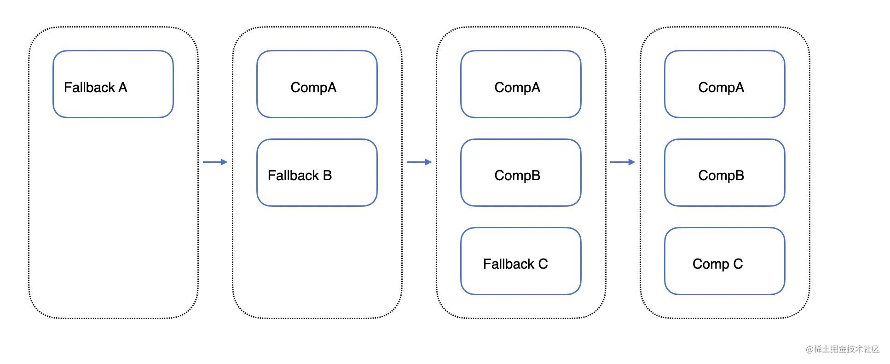
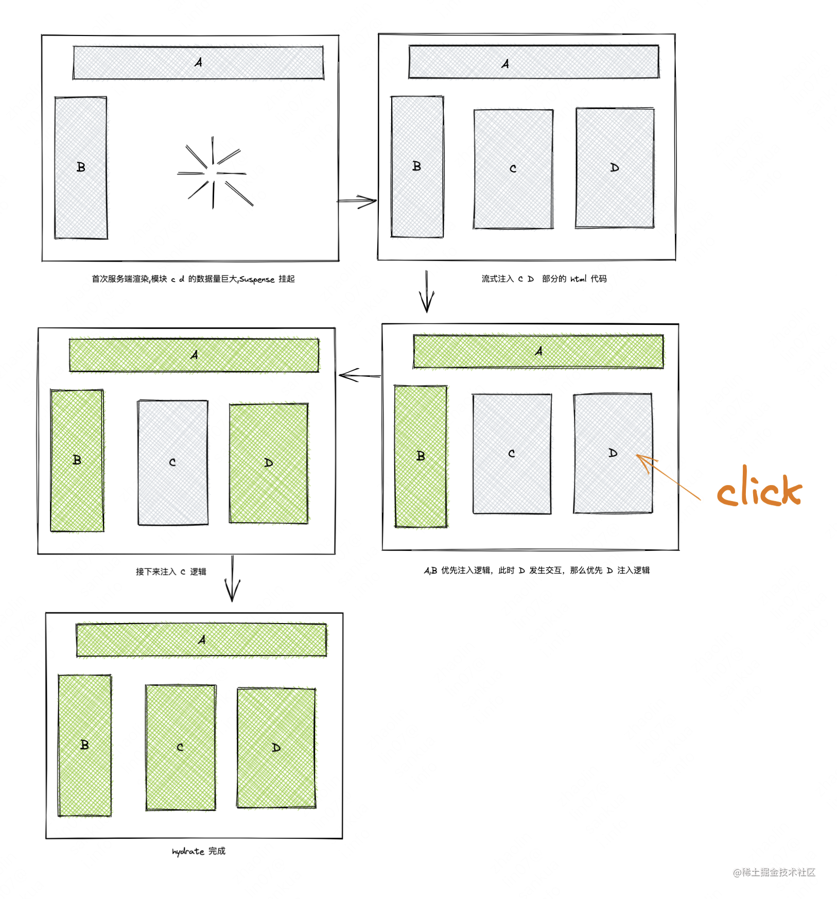

## 一前言

Suspense 做了一个提升用户体验的特性备受 React 开发者关注，目前阶段我们可以通过 Suspense + React.lazy 的方式实现代码分割，间接地减少了白屏时间，但是 Suspense 的用途远不止这些。比如异步组件，SuspenseList 这些新特性能够让开发者更优雅的编排展示页面内容。

React 对 Suspense 是情有独钟的，React v18 理所应当的对 Suspense 就更好的用户体验方向上增加了新特性。本章节我们来看一下 v18 下 Suspense 的两个新特性，**SuspenseList 和 Selective Hydration**。

## 二 v18新特性 SuspenseList

通过渲染调优章节 Suspense 的介绍，我们知道 Suspense 异步组件的原理本质上是让组件先挂起来，等到请求数据之后，再直接渲染已经注入数据的组件。

但是如果存在多个 Suspense 异步组件，并且想要控制这些组件的展示顺序，那么此时通过 Suspense 很难满足需求。

比如：


如上 C D E 都是需要 Suspense 挂起的异步组件，但是因为受到数据加载时间和展示优先级的影响，期望 C->D->E 的展示顺序，这个时候传统的 Suspense 解决不了问题。

React 18 提供了一个新组件 —SuspenseList ，SuspenseList 通过编排向用户显示这些组件的顺序，来帮助协调许多可以挂起的组件。SuspenseList 目前并没有在最新的 React v18 版本正是露面。

React 的核心开发人员表示，这个属性被移动到 @experimental npm 标签中，它没有放在 React 18.0.0 版本，可以会在 18.x 后续版本中与大家见面。

虽然没有正式出现，不过我们来看一下如何使用 SuspenseList 处理组件展示顺序。我们可以理解成 SuspenseList 可以管理一组 Suspense ，并且可以控制 Suspense 的展示顺序。

SuspenseList 接受两个 props：

第一个就是 revealOrder，这个属性表示了 SuspenseList 子组件应该显示的顺序。属性值有三个：

* forwards：从前向后展示，也就是如果后面的先请求到数据，也会优先从前到后。
* backwards：和 forwards 刚好相反，从后向前展示。
* together：在所有的子组件都准备好了的时候显示它们，而不是一个接着一个显示。

比如看一下官方的例子：

````js
<SuspenseList revealOrder="forwards">
  <Suspense fallback={'加载中...'}>
    <CompA  />
  </Suspense>
  <Suspense fallback={'加载中...'}>
    <CompB  />
  </Suspense>
  <Suspense fallback={'加载中...'}>
    <CompC  />
  </Suspense>
  ...
</SuspenseList>
````
如上当 revealOrder 属性设置成 forwards 之后，异步组件会按照 CompA -> CompB -> CompC 顺序展示。


另外一个属性就是 tail，这个属性决定了如何显示 SuspenseList 中未加载的组件。

* 默认情况下，SuspenseList 会显示列表中每个 Suspense 的 fallback。
* collapsed 仅显示 Suspense 列表中下一个   Suspense 的 fallback。
* hidden 未加载的组件不显示任何信息。

比如我们把如上案例中 SuspenseList 加入 tail = collapsed 之后，CompA ，CompB，CompC 的加载顺序如下图所示：





## 三 ssr 中的 Suspense

在 React v18 中 对服务端渲染 SSR 增加了流式渲染的特性  [New Suspense SSR Architecture in React 18](https://github.com/reactwg/react-18/discussions/37) ， 那么这个特性是什么呢？我们来看一下：


刚开始的时候，因为服务端渲染，只会渲染 html 结构，此时还没注入 js 逻辑，所以我们把它用灰色不能交互的模块表示。（如上灰色的模块不能做用户交互，比如点击事件之类的。）

 js 加载之后，此时的模块可以正常交互，所以用绿色的模块展示，我们可以把视图注入 js 逻辑的过程叫做 hydrate （注水）。

但是如果其中一个模块，服务端请求数据，数据量比较大，耗费时间长，我们不期望在服务端完全形成 html 之后在渲染，那么 React 18 给了一个新的可能性。可以使用 Suspense 包装页面的一部分，然后让这一部分的内容先挂起。


接下来会通过 script 加载 js 的方式 流式注入 html 代码的片段，来补充整个页面。接下来的流程如下所示：


* 页面 A B 是初始化渲染的，C 是 Suspense 处理的组件，在开始的时候 C 没有加载，C 通过流式渲染的方式优先注入 html 片段。
* 接下来 A B 注入逻辑，C 并没有注水。
* A B 注入逻辑之后，接下来 C 注入逻辑，这个时候整个页面就可以交互了。

在这个原理基础之上， React 个特性叫 Selective Hydration，可以**根据用户交互改变 hydrate 的顺序**。

比如有两个模块都是通过 Suspense 挂起的，当两个模块发生交互逻辑时，会根据交互来选择性地改变 hydrate 的顺序。




我们来看一下如上 hydrate 流程，在 SSR 上的流程如下：
* 初始化的渲染 A B 组件，C 和 D 通过 Suspense 的方式挂起。
* 接下来会优先注水 A B 的组件逻辑，流式渲染 C D 组件，此时 C D 并没有注入逻辑。
* 如果此时 D 发生交互，比如触发一次点击事件，那么 D 会优先注入逻辑。
* 接下来才是 C 注入逻辑，整个页面 hydrate 完毕。

## 四 总结

通过本章节的学习，我们明白了以下内容：

Suspense 的新特性 SuspenseList 将在不久的 React v18.x 版本与大家见面，SuspenseList 能够让多个 Suspense 编排展示更加灵活。

在 React v18 新特性中，Suspense 能够让 React SSR 流式渲染 html 片段，并且根据用户行为，自主的选择 hydrate 的顺序。
