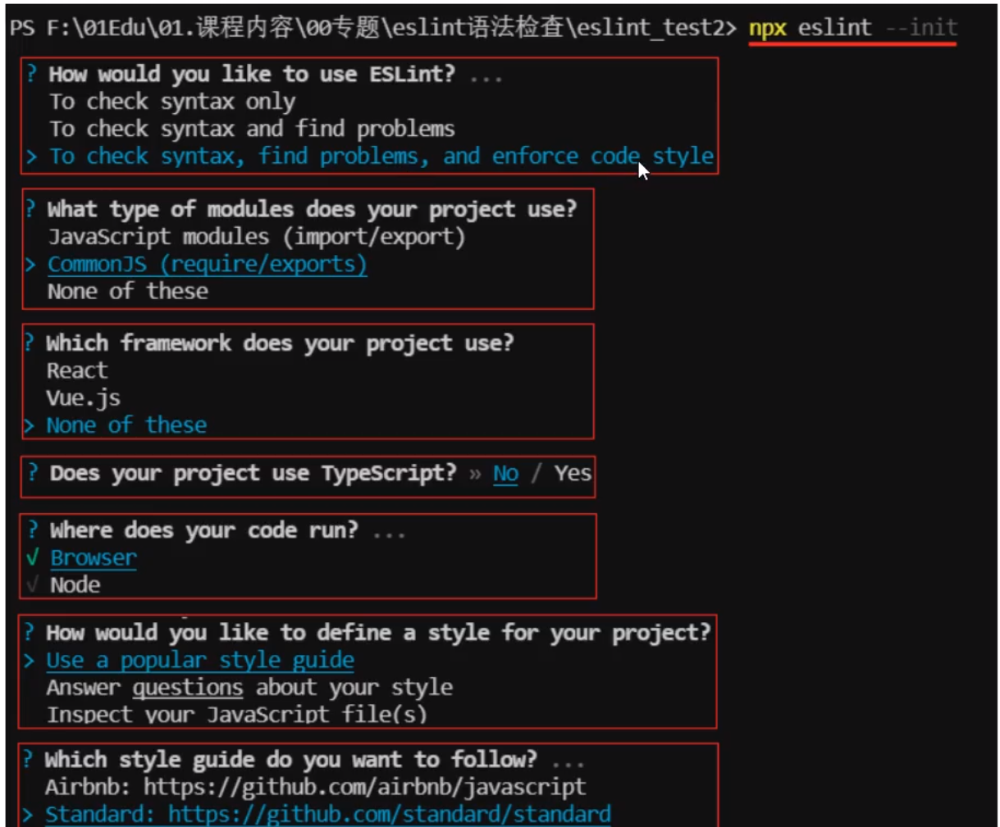

ESLint 可以创建独立的配置文件， `.eslintrc.js`， 也可以直接在 package.json 中配置。 

1. 如何手动创建 配置文件？

   1. 执行node_modules/.bin 文件目录中中的 `eslint` 脚本来创建

      ```bash
      ./node_modules/.bin/eslint --init
      ```

   2. 也可以使用 `npx` 命令来创建：

      ```bash
      npx eslint --init
      ```

2. 创建配置文件过程中， 需要选择配置：

   

eslint 本身只能检查 js 文件的语法， 如果使用了 vue 等框架， 那么就需要额外的插件去处理。 

创建完毕后，就会生成一个 `.eslintrc.js` 文件， package.json 文件也会新增一些 eslint* 相关的依赖。 

