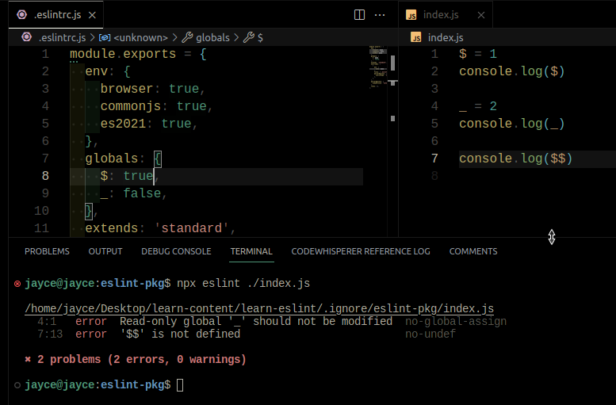

https://eslint.org/docs/latest/use/configure/

## 配置文件的格式

我们通过 `npx eslint --init` 创建配置文件的时候， 有提供配置文件的格式给我们选择`js/yaml/json`
eslint 加载配置文件的优先级是: js > yaml > json, 所以一般都用 js 格式。

## js 格式使用模式

- 我们注意到配置文件内部使用的 `module.exports` 到处配置数据

- 这是因为我们在前面添加配置文件的时候，选择了 CommonJS

  

- 如果选择了 JavaScript modules , 那么就会是使用 export 导出配置数据

- 推荐 CommonJS

  - 由于我们开发的时候，一般使用的是 vue 的脚手架， 内部 webpack 打包默认用的是 CommonJS
  - 所以 ESLint 配置文件， 应该尽可能与它保持一致


## 基础配置

### env 节点

```json
  env: {
    browser: true,
    commonjs: true,
    es2021: true
  },
```

- 由于 ESLint 的各种规范中， 一般都不允许使用未声明的成员
- 而开发中，经常会用到一些运行时环境自带的 API, 例如: 浏览器中的 `window/document`， nodejs 中的 `__dirname`, es2021 中的 `WeakRef` 等。
- 所以要告诉 eslint, 当前代码是运行在哪些环境中 ，这样检查时就不会报错了


### extends 节点

用于指明一些比较流行的 eslint 规范

这里配置的是使用三方下载的 eslint-config-standard 规范， 在配置的时候，可以省略 `eslint-config-` 前缀，直接写作`standard`.

```js
 extends: 'standard',//eslint-config-standard
```

还有一些规范是 eslint 自带的，例如：

```js
extends: 'eslint:all', //启用全部的规范配置
extends: 'eslint:recommended',//启用推荐的部分配置
```


### globals 节点

```js
  globals:{
    $:true,
    _:false
  },
```

globals节点用于告诉 eslint ， 全局环境中有哪些变量， 这些变量中， 那些又是只读的，`false` 即不可修改(只读)。 



### parseOptions节点

```js
  parserOptions: {
    ecmaVersion: 'latest',
  },
```

- ESLint 解析器 解析代码时， 可以指定 用哪个 JS 的语法标准版本

### rules 节点

```js
rules: {},
```

两个用法：

- 不使用 `extend` 节点配置 **整套的规范**, 而是在 `rules` 节点中直接配置

  

- 使用 `extend ` 节点配置 **整套的规范**， 在 `rules` 中去覆盖部分规范配置

  

