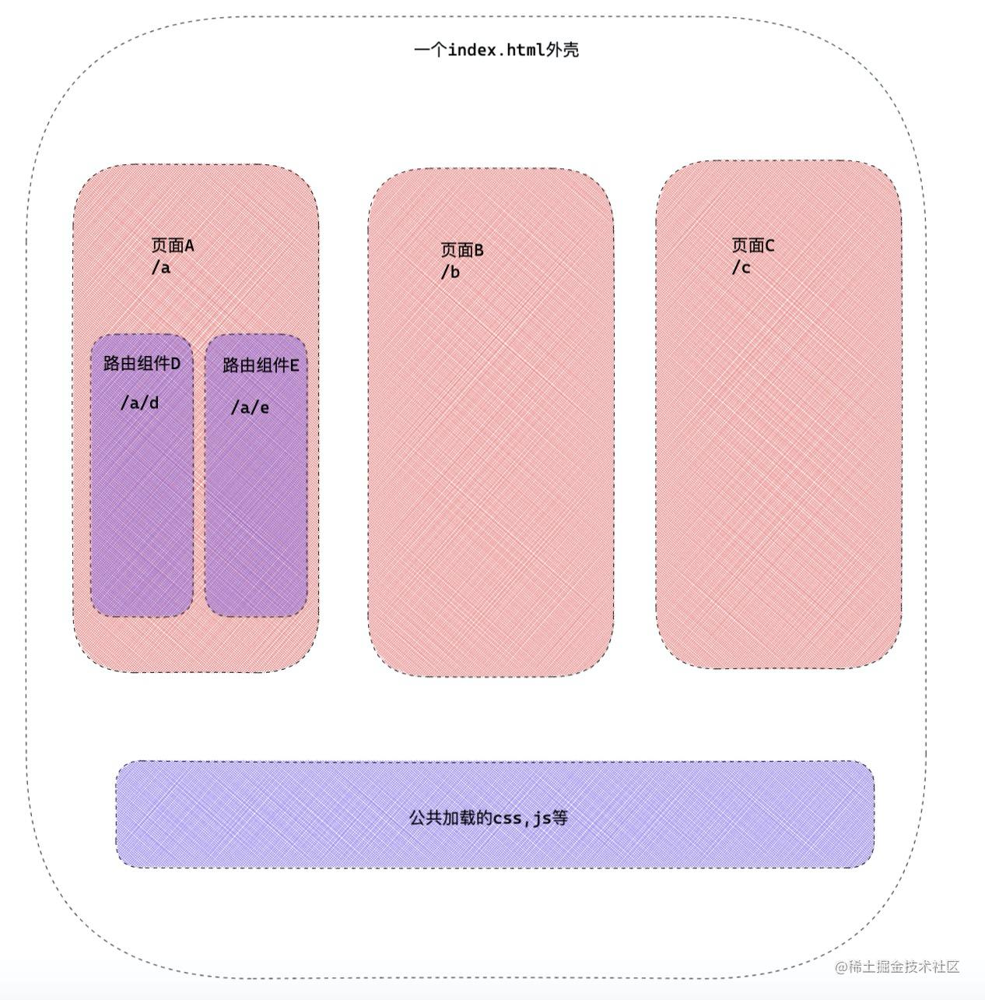
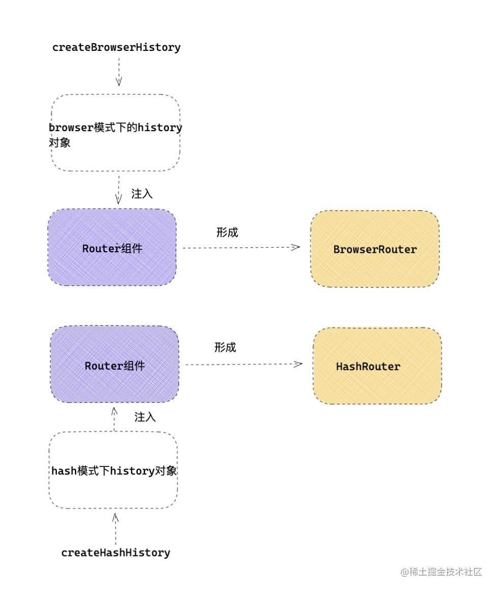
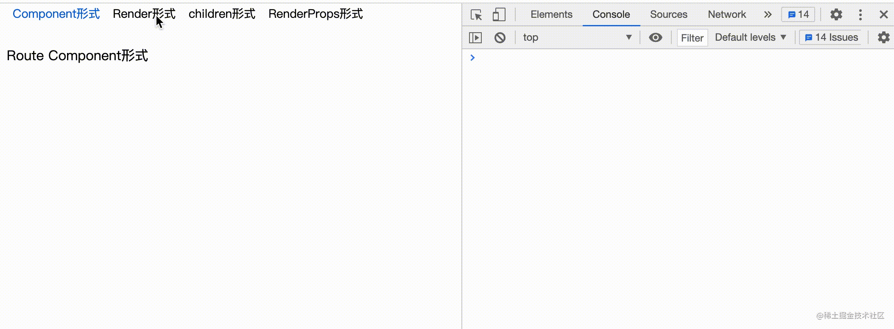
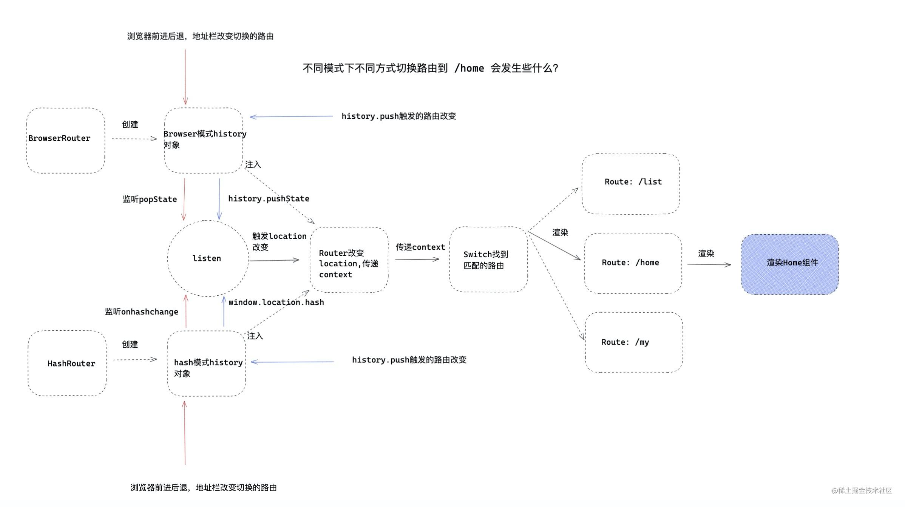
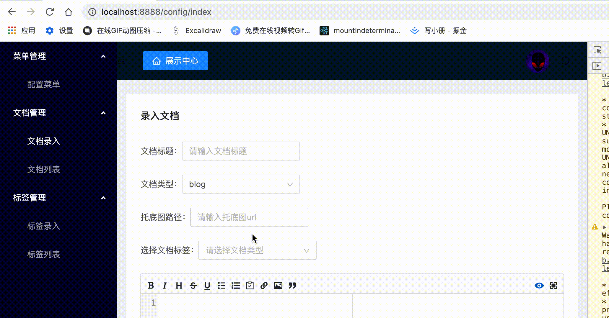

## 一 前言

前几章我们分别介绍了几个 React 核心模块原理。从本章节开始，即将开始探讨 React 生态的几个重要的部分，一部分是负责路由分发、页面跳转的 React-Router。另一部分是负责状态管理的 React-Redux 和 React-Mobx 。本章节，我们一起走进 React 路由的世界。你将学会 React 两种路由模式的使用和原理，React 路由的操作技巧，以及权限路由的实践，一次性解决面试 React 路由问题。

### 单页面应用

众所周知，用 React 或者 Vue 构建的应用都是单页面应用，单页面应用是使用一个 html 前提下，一次性加载 js ， css 等资源，所有页面都在一个容器页面下，页面切换实质是组件的切换。




## 二 路由原理

单页面路由实现方式，一直是前端面试容易提问的点之一，从路由实现到深入路由原理，都是需要必要掌握的知识，所以有必要先来探讨一下路由原理。

### 1 history ,React-router , React-router-dom 三者关系 

弄清楚 Router 原理之前，用一幅图表示 History ，React-Router ， React-Router-Dom 三者的关系。这对下面的系统学习很重要。


* **history：** history 是整个 React-router 的核心，里面包括两种路由模式下改变路由的方法，和监听路由变化方法等。
* **react-router：**既然有了 history 路由监听/改变的核心，那么需要**调度组件**负责派发这些路由的更新，也需要**容器组件**通过路由更新，来渲染视图。所以说 React-router 在 history 核心基础上，增加了 Router ，Switch ，Route 等组件来处理视图渲染。
* **react-router-dom：** 在 react-router 基础上，增加了一些 UI 层面的拓展比如 Link ，NavLink 。以及两种模式的根部路由 BrowserRouter ，HashRouter 。

### 2 两种路由主要方式

路由主要分为两种方式，一种是 history 模式，另一种是 Hash 模式。History 库对于两种模式下的监听和处理方法不同，稍后会讲到。 
两种模式的样子：

* history 模式下：`http://www.xxx.com/home` <br/>
* hash 模式下：   `http://www.xxx.com/#/home` <br/>

开发者如何在项目中运用这两种模式路由呢？答案是可以直接从 react-router-dom 引用两种模式的根路由。

* 开启 history 模式
````js
import { BrowserRouter as Router   } from 'react-router-dom'
function Index(){
    return <Router>
       { /* ...开启history模式 */ }
    </Router>
}
````
* 开启 hash 模式
````js
import { HashRouter as Router   } from 'react-router-dom'
// 和history一样
````

对于 BrowserRouter 或者是 HashRouter，实际上原理很简单，就是React-Router-dom 根据 history 提供的 createBrowserHistory 或者 createHashHistory 创建出不同的 history 对象，至于什么是 history 对象，接下来马上会讲到，以 BrowserRouter 那么先来看一下它的真面目。

> react-router-dom/modules/BrowserRouter.js
````js
import { createBrowserHistory as createHistory } from "history";
class BrowserRouter extends React.Component {
  history = createHistory(this.props) 
  render() {
    return <Router history={this.history} children={this.props.children} />;
  }
}
````
* 通过 createBrowserHistory 创建一个 history 对象，并传递给 Router 组件。


### 3 React路由原理

上面说到 history 对象，就是整个路由的核心原理，里面包含了监听路由，改变路由的方法。两种模式下的处理有一些区别，但是本质不大。

#### BrowserHistory模式下

**① 改变路由**

改变路由，指的是通过调用 api 实现的路由跳转，比如开发者在 React 应用中调用 history.push 改变路由，本质上是调用 window.history.pushState 方法。

**`window.history.pushState`**
````js
history.pushState(state,title,path)
````
* 1 `state`：一个与指定网址相关的状态对象， popstate 事件触发时，该对象会传入回调函数。如果不需要可填 null。
* 2 `title`：新页面的标题，但是所有浏览器目前都忽略这个值，可填  null 。
* 3 `path`：新的网址，必须与当前页面处在同一个域。浏览器的地址栏将显示这个地址。

**`history.replaceState`**

````js
history.replaceState(state,title,path)
````
参数和 pushState 一样，这个方法会修改当前的 history 对象记录， 但是 `history.length` 的长度不会改变。

**② 监听路由**
**`popstate`**
````js
window.addEventListener('popstate',function(e){
    /* 监听改变 */
})
````
同一个文档的 history 对象出现变化时，就会触发 popstate 事件
history.pushState 可以使浏览器地址改变，但是无需刷新页面。注意⚠️的是：用 `history.pushState()` 或者 `history.replaceState()` 不会触发 popstate 事件。 popstate 事件只会在浏览器某些行为下触发, 比如点击后退、前进按钮或者调用 `history.back()`、`history.forward()`、`history.go()`方法。

总结： BrowserHistory 模式下的 history 库就是基于上面改变路由，监听路由的方法进行封装处理，最后形成 history 对象，并传递给 Router。

#### HashHistory模式下
哈希路由原理和history相似。

**① 改变路由** 
**`window.location.hash`**

通过 `window.location.hash` 属性获取和设置 hash 值。开发者在哈希路由模式下的应用中，切换路由，本质上是改变 `window.location.hash` 。

**② 监听路由**

**`onhashchange`**
````js
window.addEventListener('hashchange',function(e){
    /* 监听改变 */
})
````
hash 路由模式下，监听路由变化用的是 hashchange 。


## 三 React-Router 基本构成

### 1 history，location，match
在路由页面中，开发者通过访问 props ，发现路由页面中 props 被加入了这几个对象，接下来分别介绍一下这几个对象是干什么的？

* `history 对象`：history对象保存改变路由方法 push ，replace，和监听路由方法 listen 等。
* `location 对象`：可以理解为当前状态下的路由信息，包括 pathname ，state 等。
* `match 对象`：这个用来证明当前路由的匹配信息的对象。存放当前路由path 等信息。

### 2 路由组件

对于路由组件，有几个是开发者必须要掌握并明白其原理的，这个对于吃透整个路由系统是很有帮助的。

#### ①Router

**Router是整个应用路由的传递者和派发更新者**。

开发者一般不会直接使用 Router ，而是使用 react-router-dom 中  BrowserRouter 或者 HashRouter ，两者关系就是 Router 作为一个传递路由和更新路由的容器，而 BrowserRouter 或 HashRouter 是不同模式下向容器 Router 中注入不同的 history 对象。所以开发者确保整个系统中有一个根部的 BrowserRouter 或者是 HashRouter 就可以了。

综上先用一幅图来描述 Router 和 BrowserRouter 或 HashRouter 的关系：





为了让大家了解路由的更新机制，所以有必要去研究 Router 内部到底做了些什么？

> react-router/modules/Router.js
````js
class Router extends React.Component{
    constructor(props){
        super(props)
        this.state = {
           location: props.history.location
        }
        this.unlisten = props.history.listen((location)=>{ /* 当路由发生变化，派发更新 */
            this.setState({ location })
        })
    }
    /* .... */
    componentWillUnmount(){  if (this.unlisten) this.unlisten() } 
    render(){
        return  <RouterContext.Provider  
            children={this.props.children || null}  
            value={{
                history: this.props.history, 
                location: this.state.location,
                match: Router.computeRootMatch(this.state.location.pathname),
                staticContext: this.props.staticContext
            }}
        />
    }
}
````
Router 包含的信息量很大
* 首先 React-Router 是通过 context 上下文方式传递的路由信息。在 context 章节讲过，context 改变，会使消费 context 组件更新，这就能合理解释了，当开发者触发路由改变，为什么能够重新渲染匹配组件。
* props.history 是通过 BrowserRouter 或 HashRouter 创建的history 对象，并传递过来的，当路由改变，会触发 listen 方法，传递新生成的 location ，然后通过 setState 来改变 context 中的 value ，所以改变路由，本质上是 location 改变带来的更新作用。

#### ②Route
Route 是整个路由核心部分，它的工作主要就是一个： **匹配路由，路由匹配，渲染组件。** 由于整个路由状态是用 context 传递的，所以 Route 可以通过 `RouterContext.Consumer` 来获取上一级传递来的路由进行路由匹配，如果匹配，渲染子代路由。并利用 context 逐层传递的特点，将自己的路由信息，向子代路由传递下去。这样也就能轻松实现了嵌套路由。

那么先来看一下 Route 用法。

**四种Route编写格式**
````js
function Index(){ 
    const mes = { name:'alien',say:'let us learn React!' }
    return <div>      
        <Meuns/>
        <Switch>
            <Route path='/router/component'   component={RouteComponent}   /> { /* Route Component形式 */ }
            <Route path='/router/render'  render={(props)=> <RouterRender { ...props }  /> }  {...mes}  /> { /* Render形式 */ }
            <Route path='/router/children'  > { /* chilren形式 */ }
                <RouterChildren  {...mes} />
            </Route>
            <Route path="/router/renderProps"  >
                { (props)=> <RouterRenderProps {...props} {...mes}  /> }  {/* renderProps形式 */}
            </Route>
        </Switch>
    </div>
}
export default Index
````


* path 属性：Route 接受 path 属性，用于匹配正确的理由，渲染组件。
* 对于渲染组件 Route 可以接受四种方式。

**四种形式：**

* `Component` 形式：将组件直接传递给 Route 的 component 属性，Route 可以将路由信息隐式注入到页面组件的 props 中，但是无法传递父组件中的信息，比如如上 mes 。<br/>
* `render` 形式：Route 组件的 render 属性，可以接受一个渲染函数，函数参数就是路由信息，可以传递给页面组件，还可以混入父组件信息。<br/>
* `children` 形式：直接作为 children 属性来渲染子组件，但是这样无法直接向子组件传递路由信息，但是可以混入父组件信息。<br/>
* `renderProps` 形式：可以将 childen 作为渲染函数执行，可以传递路由信息，也可以传递父组件信息。





**exact**

Route 可以加上 exact ，来进行精确匹配，精确匹配原则，pathname  必须和 Route 的 path 完全匹配，才能展示该路由信息。打个比方。
````js
<Route path='/router/component' exact  component={RouteComponent}  />
````
一旦开发者在 Route 中写上 `exact=true` ，表示该路由页面只有 `/router/component` 这个格式才能渲染，如果 `/router/component/a` 那么会被判定不匹配，从而导致渲染失败。**所以如果是嵌套路由的父路由，千万不要加 exact=true 属性。换句话只要当前路由下有嵌套子路由，就不要加 exact** 。

**优雅写法**

当然可以用 `react-router-config` 库中提供的 `renderRoutes` ，更优雅的渲染 Route 。

````js

const RouteList = [
    {
        name: '首页',
        path: '/router/home',  
        exact:true,
        component:Home
    },
    {
        name: '列表页',
        path: '/router/list',  
        render:()=><List />
    },
    {
        name: '详情页',
        path: '/router/detail',  
        component:detail
    },
    {
        name: '我的',
        path:'/router/person',
        component:personal
    }
] 
function Index(){
    return <div>
        <Meuns/>
        { renderRoutes(RouteList) }
    </div> 
}
````
这样的效果和上述一样，省去了在组件内部手动写 Route ，绑定 path ，component 等属性。


#### ③Switch
Switch 有什么作用呢，假设在组件中像如下这么配置路由：
````js
<div>
   <Route path='/home'  component={Home}  />
   <Route path='/list'  component={List}  />
   <Route path='/my'  component={My}  />
</div>
````
这样会影响页面的正常展示和路由的正常切换吗？答案是否定的，这样对于路由切换页面展示没有影响，但是值得注意的是，如果在页面中这么写，**三个路由都会被挂载**，但是每个页面路由展示与否，是通过 Route 内部 location 信息匹配的。

那么 Switch 作用是先通过匹配选出一个正确路由 Route 进行渲染。

````js
<Switch>
   <Route path='/home'  component={Home}  />
   <Route path='/list'  component={List}  />
   <Route path='/my'  component={My}  />
</Switch>
````

如果通过 Switch 包裹后，那么页面上只会展示一个正确匹配的路由。比如路由变成 `/home` ，那么只会挂载 `path='/home'` 的路由和对应的组件 Home 。综上所述 Switch 作用就是匹配唯一正确的路由并渲染。

#### ④Redirect

假设有下面两种情况：
* 当如果修改地址栏或者调用 api 跳转路由的时候，当找不到匹配的路由的时候，并且还不想让页面空白，那么需要重定向一个页面。

* 当页面跳转到一个无权限的页面，期望不能展示空白页面，需要重定向跳转到一个无权限页面。

这时候就需要重定向组件 Redirect ，**Redirect 可以在路由不匹配情况下跳转指定某一路由，适合路由不匹配或权限路由的情况。**

对于上述的情况一：
````js
<Switch>
   <Route path='/router/home'  component={Home}  />
   <Route path='/router/list'  component={List}  />
   <Route path='/router/my'  component={My}  />
   <Redirect from={'/router/*'} to={'/router/home' }  />
</Switch>
````
如上例子中加了 Redirect，当在浏览器输入 `/router/test` ，没有路由与之匹配，所以会重定向跳转到 `/router/home`。

对于上述的情况二：
````js
  noPermission ?  <Redirect from={'/router/list'} to={'/router/home' }  />  : <Route path='/router/list'  component={List}  />
````
如果 `/router/list` 页面没有权限，那么会渲染 `Redirect` 就会重定向跳转到 `/router/home`，反之有权限就会正常渲染 `/router/list`。

* 注意 Switch 包裹的 Redirect 要放在最下面，否则会被 Switch 优先渲染 Redirect ，导致路由页面无法展示。

### 3 从路由改变到页面跳转流程图

我用一幅图描述当用户触发 history.push ，或者点击浏览器前进后退，路由改变到页面重新渲染流程。




## 四 路由使用指南
对于路由使用，还有一些细节值得去思考。

### 1 路由状态获取

对于路由状态获取，首先如果想要在一些子页面中获取 history 或者 location ，实现路由匹配或者路由跳转。

#### ① 路由组件 props 

上面讲到过，被 Route 包裹的路由组件 props 中会默认混入 history 等信息，那么如果路由组件的子组件也想共享路由状态信息和改变路由的方法，那么 props 可以是一个很好的选择。

````js
class Home extends React.Component{
    render(){
        return <div>
            <Children {...this.props}  />
        </div>
    }
}
````
Home 组件是 Route 包裹的组件，那么它可以通过 props 方式向 Children 子组件中传递路由状态信息（ histroy ，loaction ）等。

#### ② withRouter

对于距离路由组件比较远的深层次组件，通常可以用 react-router 提供的 `withRouter` 高阶组件方式获取 histroy ，loaction 等信息。

````js
import { withRouter } from 'react-router-dom'
@withRouter
class Home extends React.Component{
    componentDidMount(){
        console.log(this.props.history)
    }
    render(){
        return <div>
            { /* ....*/ }
        </div>
    }
}
````
#### ③ useHistory 和 useLocation

对于函数组件，可以用 `React-router` 提供的自定义 hooks 中的 useHistory 获取 history 对象，用 useLocation 获取 location 对象。

````js
import { useHistory ,useLocation  } from 'react-router-dom'
function Home(){
    const history = useHistory() /* 获取history信息 */
    const useLocation = useLocation() /* 获取location信息 */
}
````

* 注意事项，无论是 withRouter ，还是 hooks ，都是从保存的上下文中获取的路由信息，所以要保证想要获取路由信息的页面，都在根部 Router 内部。

### 2 路由带参数跳转

#### ① 路由跳转

关于路由跳转有**声明式路由**和**函数式路由**两种。
* 声明式：`<NavLink to='/home' />` ，利用 react-router-dom 里面的 `Link` 或者 `NavLink` 。
* 函数式：`histor.push('/home')` 。

#### ② 参数传递

有的时候页面间需要传递信息。这里介绍几种传递参数的方式。

**url拼接**
````js
const name = 'alien'
const mes = 'let us learn React!'
history.push(`/home?name=${name}&mes=${mes}`)
````
这种方式通过 url 拼接，比如想要传递的参数，会直接暴露在 url 上，而且需要对 url 参数，进行解析处理，实际开发中我不推荐这种方式，我更推荐下面的方式。

**state路由状态。**

````js
const name = 'alien'
const mes = 'let us learn React!'
history.push({
    pathname:'/home',
    state:{
        name,
        mes
    }
})
````
可以在 location 对象上获取上个页面传入的 state 。

````js
 const {state = {}} = this.prop.location
 const { name , mes } = state
````

#### ③ 动态路径参数路由

路由中参数可以作为路径。比如像掘金社区的文章详情，就是通过路由路径带参数（文章 ID ）来实现精确的文章定位。在绑定路由的时候需要做如下处理。

````js
<Route path="/post/:id"  />
````
`:id` 就是动态的路径参数，

路由跳转：
````js
history.push('/post/'+id) // id为动态的文章id
````

### 3 嵌套路由

对于嵌套路由实际很简单。就是路由组件下面，还存在子路由的情况。比如如下结构：

````js
/* 第二层嵌套路由 */
function Home(){
    return <div>
        <Route path='/home/test' component={Test}   />
        <Route path='/home/test1' component={Test1}  />
    </div>
}

/* 第一层父级路由 */
function Index(){
    return <Switch>
        <Route path="/home" component={Home}  />
        <Route path="/list" component={List}  />
        <Route path="/my" component={My}  />
    </Switch>
}
````
**嵌套路由子路由一定要跟随父路由。比如父路由是 /home ，那么子路由的形式就是 /home/xxx ，否则路由页面将展示不出来。**

### 4 路由拓展

可以对路由进行一些功能性的拓展。比如可以实现自定义路由，或者用 HOC 做一些拦截，监听等操作。

**自定义路由**
````js
function CustomRouter(props){
    const permissionList = useContext(permissionContext) /* 获取权限列表 */
    const haspermission = matchPermission(permissionList,props.path)  /* 检查是否具有权限 */
    return haspermission ? <Route  {...props}  /> :  <Redirect  to="/noPermission" />
}
````
* 上述编写一个自定义路由检查是否具有权限，如果没有权，那么直接重定向到没有权限页面。

使用：

````js
<CustomRouter  path='/list' component={List}  />
````
注意：一旦对路由进行自定义封装，就要考虑上面四种 Route 编写方式，如上写的自定义 Route 只支持 component 和 render 形式。

## 五 实践一权限路由封装

之前在 HOC 章节讲了通过 HOC 来对路由进行拦截，然后进行路由匹配，今天将要换一种思路，用自定义路由拦截，如果没有权限就重定向到无权限页面中。


假设期望的效果是：

* 1 模拟数据交互，返回模拟数据，拦截文档列表和标签列表两个页面。

思路：

* 1 编写自定义权限路由组件，组件内部判断当前页面有无权限，如果没有权限，跳转无权限页面。
* 2 通过 Context 保存权限列表，数据交互

**第一步：根组件注入权限**

````js
function getRootPermission(){
    return new Promise((resolve)=>{
        resolve({
            code:200, /* 数据模拟只有编写文档，和编写标签模块有权限，文档列表没有权限 */
            data:[ '/config/index'  , '/config/writeTag' ]
        })
    })
}
/* 路由根部组件 */
const Permission = React.createContext([])
export default function Index(){
    const [ rootPermission , setRootPermission ] = React.useState([])
    React.useEffect(()=>{
        /* 获取权限列表 */
        getRootPermission().then(res=>{
            console.log(res,setRootPermission)
            const { code , data } = res as any
            code === 200 && setRootPermission(data)
        }) 
    },[])
    return <Permission.Provider value={rootPermission} >
         <RootRouter/>
    </Permission.Provider>
}
````

**第二步：编写权限路由**
````js
export function PermissionRouter(props){
    const permissionList = useContext(Permission) /* 消费权限列表 */
    const isMatch = permissionList.indexOf(props.path) >= 0 /* 判断当前页面是否有权限 */
    return isMatch ? <Route {...props}  /> : <Redirect to={'/config/NoPermission'}  />
````
* useContext 接受消费权限列表，判断当前页面是否有权限，如果没有权限那么跳转无权限页面。


**第三步：注册权限路由和无权限跳转页面**

````js
 <Switch>
    <PermissionRouter   path={'/config/index'} component={WriteDoc}   />
    <PermissionRouter   path={'/config/docList'} component={DocList}   />
    <PermissionRouter   path={'/config/writeTag'} component={WriteTag}   />
    <PermissionRouter   path={'/config/tagList'} component={TagList}   />
    <Route path={'/config/NoPermission'}  component={NoPermission}  />
</Switch>
````

完美达到效果：





## 六 总结

本章节从路由原理，路由内部构成和分工，路由使用指南，路由实践-权限路由四个模块系统的学习了 React-Router 。

对于 history 部分的源码和原理，我没有具体分析，感兴趣的同学可以看我写的源码解析系列。

[「源码解析 」这一次彻底弄懂react-router路由原理](https://juejin.cn/post/6886290490640039943)

下一节将一起研究React-Redux的奥秘。
