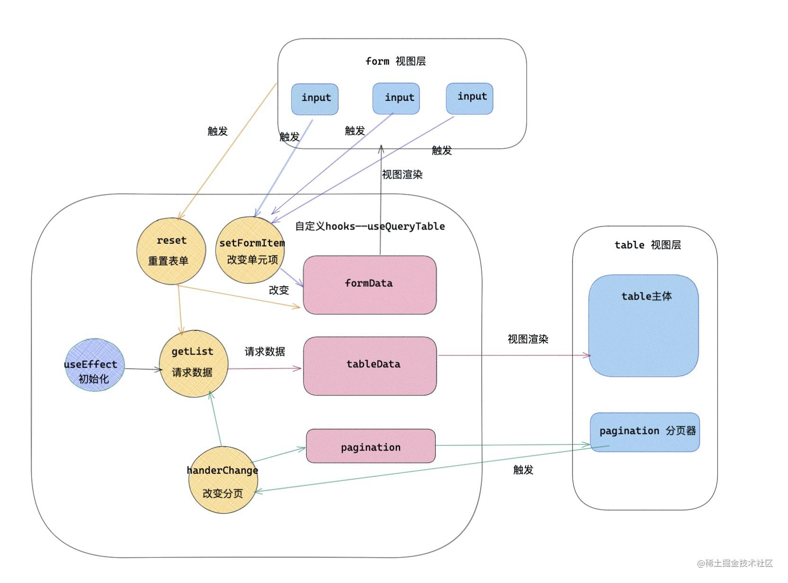
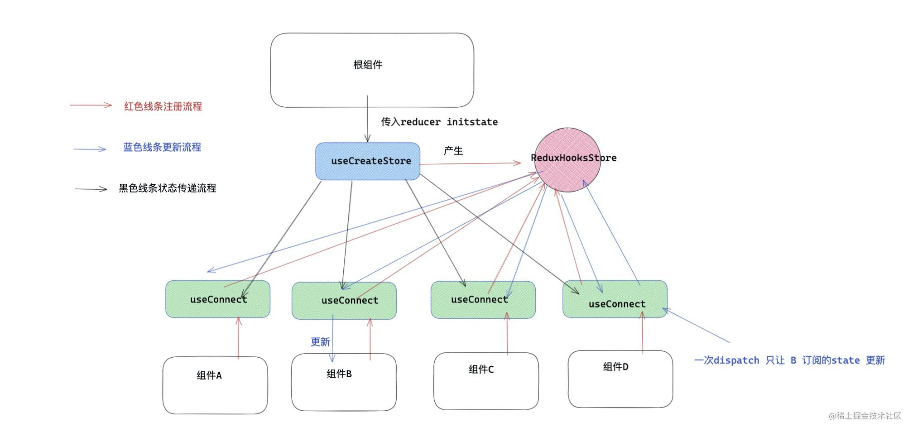
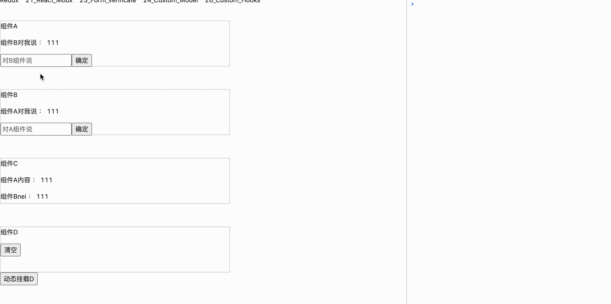

## 一 前言

上章节讲到了自定义 hooks 的特性和设计原则，本章节将记录自定义 hooks 一些具体的应用场景。

## 二 实践一：自动上报pv/click的埋点hooks—— useLog

接下来实现一个能够自动上报 点击事件 | pv 的自定义 hooks 。通过这个自定义 hooks ，将带来的收获是：

* 通过自定义 hooks 控制监听 DOM 元素。
* 分清自定义 hooks 依赖关系。

**编写**

````js
export const LogContext = React.createContext({})

export default function useLog(){
    /* 一些公共参数 */
    const message = React.useContext(LogContext)
    const listenDOM = React.useRef(null)

    /* 分清依赖关系 -> message 改变，   */
    const reportMessage = React.useCallback(function(data,type){
        if(type==='pv'){ // pv 上报
            console.log('组件 pv 上报',message)
        }else if(type === 'click'){  // 点击上报
            console.log('组件 click 上报',message,data)
        }
    },[ message ])

    React.useEffect(()=>{
        const handleClick = function (e){
            reportMessage(e.target,'click')
        }
        if(listenDOM.current){
            listenDOM.current.addEventListener('click',handleClick)
        }

        return function (){
            listenDOM.current && listenDOM.current.removeEventListener('click',handleClick)
        }
    },[ reportMessage  ])

    return [ listenDOM , reportMessage  ]
}
````

* 用 `useContext` 获取埋点的公共信息。当公共信息改变，会统一更新。
* 用 `useRef` 获取 DOM 元素。
* 用 `useCallback` 缓存上报信息 reportMessage 方法，里面获取 useContext 内容。把 context 作为依赖项。当依赖项改变，重新声明 reportMessage 函数。
* 用 `useEffect`监听 DOM 事件，把 reportMessage 作为依赖项，在 useEffect 中进行事件绑定，返回的销毁函数用于解除绑定。

**依赖关系：**  context 改变 -> 让引入 context 的 reportMessage 重新声明 -> 让绑定 DOM 事件监听的 useEffect 里面能够绑定最新的 reportMessage 。

如果上述没有分清楚依赖项关系，那么 context 改变，会让 reportMessage 打印不到最新的 context 值。


**使用**

````js
 function Home(){
    const [ dom , reportMessage  ] = useLog()
    return <div>
        {/* 监听内部点击 */}
        <div ref={dom} >
            <p> 《React进阶实践指南》</p>
            <button> 按钮 one   (内部点击) </button>
            <button> 按钮 two   (内部点击) </button>
            <button> 按钮 three (内部点击)  </button>
        </div>
        {/* 外部点击 */}
        <button  onClick={()=>{ console.log(reportMessage)  }} > 外部点击 </button>
    </div>
}
const Index = React.memo(Home) /*  阻断 useState 的更新效应  */
export default function Root(){
    const [ value , setValue ] = useState({})
    return  <LogContext.Provider value={value} >
        <Index />
        <button onClick={()=> setValue({ name:'《React进阶实践指南》' , author:'我不是外星人'  })} >点击</button>
    </LogContext.Provider>
}
````

如上当 context 改变，能够达到正常上报的效果。有一个小细节，就是用 `React.memo` 来阻断 Root 组件改变 state 给 Home 组件带来的更新效应。


**效果**


## 三 实践二：带查询的分页加载长列表—— useQueryTable 

 saas 管理系统中，大概率会存在带查询的表格场景，那么可不可以把整个表单和表格的数据逻辑层交给一个自定义 hooks 来搞定，这样的好处是接下来所有类似该功能的页面，只需要**一个自定义 hooks + 公共组件 + 配置项**就能搞定了。

接下来实现一个带查询分页的功能，把**所有的逻辑**都交给一个自定义 hooks 去处理，组件只负责接收自定义 hooks 的状态。

### 设计原则

useQueryTable 的设计主要分为两部分，分别为表格和查询表单。

* 表格设计：表格的数据状态层，改变分页方法，请求数据的方法。
* 表单设计：表单的状态层，以及改变表单单元项的方法，重置表单重新请求数据。

### 设计模型图

自定义 hooks —— useQueryTable 的设计模型图如下：




### 代码实现

**编写：**
````js
/**
 *
 * @param {*} defaultQuery  表单查询默认参数
 * @param {*} api           biaog
 */
function useQueryTable(defaultQuery = {},api){
   /* 保存查询表格表单信息 */
   const formData = React.useRef({})
   /* 保存查询表格分页信息 */
   const pagination = React.useRef({
       page:defaultQuery.page || 1,
       pageSize:defaultQuery.pageSize || 10
   })

   /* 强制更新 */
   const [, forceUpdate] = React.useState(null)

   /* 请求表格数据 */
   const [tableData, setTableData] = React.useState({
     data: [],
     total: 0,
     current: 1
  })

   /* 请求列表数据 */
   const getList = React.useCallback(async function(payload={}){
        if(!api) return
        const data = await api({ ...defaultQuery, ...payload, ...pagination.current,...formData.current}) || {}
        if (data.code == 200) {
            setTableData({ list:data.list,current:data.current,total:data.total })
        } else {}
   },[ api ]) /* 以api作为依赖项，当api改变，重新声明getList */

    /* 改变表单单元项 */
    const setFormItem = React.useCallback(function (key,value){
        const form = formData.current
        form[key] = value
        forceUpdate({}) /* forceUpdate 每一次都能更新，不会造成 state 相等的情况 */
   },[])

   /* 重置表单 */
   const reset = React.useCallback(function(){
        const current = formData.current
        for (let name in current) {
            current[name] = ''
        }
        pagination.current.page = defaultQuery.page || 1
        pagination.current.pageSize = defaultQuery.pageSize || 10
        /* 请求数据  */
        getList()
   },[ getList ]) /* getList 作为 reset 的依赖项  */

   /* 处理分页逻辑 */
   const handerChange = React.useCallback(async function(page,pageSize){
        pagination.current = {
            page,
            pageSize
        }
        getList()
   },[ getList ]) /* getList 作为 handerChange 的依赖项  */

   /* 初始化请求数据 */
   React.useEffect(()=>{
       getList()
   },[])

   /* 组合暴露参数 */
   return [
        {  /* 组合表格状态 */
           tableData,
           handerChange,
           getList,
           pagination:pagination.current
        },
        {  /* 组合搜索表单状态 */
            formData:formData.current,
            setFormItem,
            reset
        }
    ]
}
````
**设计分析：**

接收参数 ：编写的自定义 hooks 接收两个参数。

* `defaultQuery`：表格的默认参数，有些业务表格，除了查询和分页之外，有一些独立的请求参数。
* `api` ： api 为请求数据方法，内部用 `Promise` 封装处理。

数据层：

* 用第一个 useRef 保存查询表单信息 formData 。 第二个 useRef 保存表格的分页信息 pagination 。
* 用第一个 useState 做**受控表单组件更新视图**的渲染函数。第二个 useState 保存并负责更新表格的状态。

控制层：控制层为**控制表单表格整体联动**的方法。

* 编写内部和对外公共方法 `getList`，方法内部使用 api 函数发起请求，通过 `setTableData` 改变表格数据层状态，用 `useCallback` 做优化缓存处理 。 
* 编写改变表单单元项的方法 `setFormItem`，这个方法主要给查询表单控件使用，内部改变 formData 属性，并通过 useState 更新组件，改变表单控件视图，用 `useCallback` 做优化缓存处理。
* 编写重置表单的方法 `reset` ，reset 会清空 formData 属性和重置分页的信息。然后重新调用 getList 请求数据，用 `useCallback` 做优化缓存处理。
* 编写给表格分页器提供的接口 `handerChange` 内部改变分页信息，然后重新请求数据，用 `useCallback` 做优化缓存处理。。
* 用 useEffect 作为初始化请求表格数据的副作用。

返回状态：
* 通过数组把表单和表格的聚合状态暴露出去。

注意事项：

* 请求方法要与后端进行对齐，包括返回的参数结构，成功状态码等。
* 属性的声明要与 UI 组件对齐，这里统一用的是 antd 里面的表格和表单控件。

**使用：**
````js
/* 模拟数据请求 */
function getTableData(payload){
    return new Promise((resolve)=>{
        Promise.resolve().then(()=>{
            const { list } = listData
            const arr = threeNumberRandom()  // 生成三个随机数 模拟数据交互
            console.log('请求参数：',payload)
            resolve({
                ...listData,
                list:[ list[arr[0]],list[arr[1]],list[arr[2]] ],
                total:list.length,
                current:payload.page || 1
            })
        })
    })
}
function Index (){
    const [ table,form ] = useQueryTable({ pageSize:3 },getTableData)
    const { formData ,setFormItem , reset  } = form
    const { pagination , tableData , getList  , handerChange } = table
    return <div style={{ margin:'30px' }} >
        <div style={{ marginBottom:'24px' }} >
            <Input onChange={(e)=> setFormItem('name',e.target.value)}
                placeholder="请输入名称"
                style={inputStyle}
                value={formData.name || ''}
            />
             <Input onChange={(e)=> setFormItem('price',e.target.value)}
                 placeholder="请输入价格"
                 style={inputStyle}
                 value={formData.price || ''}
             />
             <Select onChange={(value) => setFormItem('type',value)}
                 placeholder="请选择"
                 style={inputStyle}
                 value={formData.type}
             >
                 <Option value="1" >家电</Option>
                 <Option value="2" >生活用品</Option>
             </Select>
            <button className="searchbtn"
                onClick={() => getList()}
            >提交</button>
             <button className="concellbtn"
                 onClick={reset}
             >重置</button>
        </div>
        {useCallback( <Table
            columns={columns}
            dataSource={tableData.list}
            height="300px"
            onChange={(res)=>{ handerChange(res.current,res.pageSize) }}
            pagination={{ ...pagination, total: tableData.total ,current:tableData.current }}
            rowKey="id"
                      />,[tableData])}
    </div>
}
````

**效果**


* 整个查询表格逻辑层基本就一个自定义 hooks —— `useQueryTable` 就搞定了。
* `getTableData` 模拟了数据交互过程 ，其内部的代码逻辑不必纠结 。
* `useCallback` 对 Table 的 React element 做缓存处理，这样频繁的表单控件更新，不会让 Table 组件重新渲染。


## 四 实践三：实现React-Redux功能—— useCreateStore | useConnect

下面我将用**两个自定义 hooks 实现 `React-Redux` 基本功能**。 一个是注入 Store 的 `useCreateStore` ，另外一个是负责订阅更新的 `useConnect` ，通过这个实践 demo ，将收获以下知识点：

* 如何将不同组件的自定义 hooks 建立通信，共享状态。
* 合理编写自定义 hooks ， 分析 hooks 之间的依赖关系。


首先，看一下要实现的两个自定义 hooks 具体功能。

*  `useCreateStore` 用于产生一个状态 Store ，通过 context 上下文传递 ，为了让每一个自定义 hooks `useConnect` 都能获取 context 里面的状态属性。
*  `useConnect` 使用这个自定义 hooks 的组件，可以获取改变状态的 dispatch 方法，还可以订阅 state ，被订阅的 state 发生变化，组件更新。

### 1 设计思路

**如何让不同组件的自定义 hooks 共享状态并实现通信呢？**

首先不同组件的自定义 hooks ，可以通过 `useContext` 获得共有状态，而且还需要实现状态管理和组件通信，那么就需要一个状态调度中心来统一做这些事，可以称之为 `ReduxHooksStore` ，它具体做的事情如下：

* 全局管理 state， state 变化，通知对应组件更新。
* 收集使用 `useConnect` 组件的信息。组件销毁还要清除这些信息。
* 维护并传递负责更新的 `dispatch` 方法。
* 一些重要 api 要暴露给 context 上下文，传递给每一个 `useConnect`。

#### useCreateStore 设计

首先 `useCreateStore` 是在靠近根部组件的位置的， 而且全局只需要一个，目的就是创建一个 `Store` ，并通过 `Provider` 传递下去。

使用：
````js
const store = useCreateStore( reducer , initState )
````
参数：
* `reducer` ：全局 reducer，纯函数，传入 state 和 action ，返回新的 state 。
* `initState` ： 初始化 state 。

返回值：为 store 暴露的主要功能函数。

#### Store设计

Store 为上述所说的调度中心，接收全局 reducer ，内部维护状态 state ，负责通知更新 ，收集用 useConnect 的组件。  

````js
const Store = new ReduxHooksStore(reducer,initState).exportStore()
````

参数：接收两个参数，透传 useCreateStore 的参数。

#### useConnect设计

使用 useConnect 的组件，将获得 dispatch 函数，用于更新 state ，还可以通过第一个参数订阅 state ，被订阅的 state 改变 ，会让组件更新。

````js
// 订阅 state 中的 number 
const mapStoreToState = (state)=>({ number: state.number  })
const [ state , dispatch ] = useConnect(mapStoreToState)
````
参数：
* `mapStoreToState`：将 Store 中 state ，映射到组件的 state 中，可以做视图渲染使用。
* 如果没有第一个参数，那么只提供 `dispatch` 函数，不会订阅 state 变化带来的更新。

返回值：返回值是一个数组。

* 数组第一项：为映射的 state 的值。
* 数组第二项：为改变 state 的 `dispatch` 函数。


#### 原理图





### 2 useCreateStore 

````js
export const ReduxContext = React.createContext(null)
/* 用于产生 reduxHooks 的 store */
export function useCreateStore(reducer,initState){
   const store = React.useRef(null)
   /* 如果存在——不需要重新实例化 Store */
   if(!store.current){
       store.current  = new ReduxHooksStore(reducer,initState).exportStore()
   }
   return store.current
}
````
`useCreateStore` 主要做的是：

* 接收 `reducer` 和 `initState` ，通过 ReduxHooksStore 产生一个 store ，不期望把 store 全部暴露给使用者，只需要暴露核心的方法，所以调用实例下的 `exportStore`抽离出核心方法。 

* 使用一个 `useRef` 保存核心方法，传递给 `Provider` 。 

### 3 状态管理者 —— ReduxHooksStore

接下来看一下核心状态 ReduxHooksStore 。

````js
import { unstable_batchedUpdates } from 'react-dom'
class ReduxHooksStore {
    constructor(reducer,initState){
       this.name = '__ReduxHooksStore__'
       this.id = 0
       this.reducer = reducer
       this.state = initState
       this.mapConnects = {}
    }
    /* 需要对外传递的接口 */
    exportStore=()=>{
        return {
            dispatch:this.dispatch.bind(this),
            subscribe:this.subscribe.bind(this),
            unSubscribe:this.unSubscribe.bind(this),
            getInitState:this.getInitState.bind(this)
        }
    }
    /* 获取初始化 state */
    getInitState=(mapStoreToState)=>{
        return mapStoreToState(this.state)
    }
    /* 更新需要更新的组件 */
    publicRender=()=>{
        unstable_batchedUpdates(()=>{ /* 批量更新 */
            Object.keys(this.mapConnects).forEach(name=>{
                const { update } = this.mapConnects[name]
                update(this.state)
            })
        })
    }
    /* 更新 state  */
    dispatch=(action)=>{
       this.state = this.reducer(this.state,action)
       // 批量更新
       this.publicRender()
    }
    /* 注册每个 connect  */
    subscribe=(connectCurrent)=>{
        const connectName = this.name + (++this.id)
        this.mapConnects[connectName] =  connectCurrent
        return connectName
    }
    /* 解除绑定 */
    unSubscribe=(connectName)=>{
        delete this.mapConnects[connectName]
    }
}
````

#### 状态

* `reducer`：这个 reducer 为全局的 reducer ，由 useCreateStore 传入。
* `state`：全局保存的状态 state ，每次执行 reducer 会得到新的 state 。
* `mapConnects`：里面保存每一个 useConnect 组件的更新函数。用于派发 state 改变带来的更新。 

#### 方法

**负责初始化：**

* `getInitState`：这个方法给自定义 hooks 的 useConnect 使用，用于获取初始化的 state 。 
* `exportStore`：这个方法用于把 ReduxHooksStore 提供的核心方法传递给每一个 useConnect 。

**负责绑定｜解绑：**

* `subscribe`： 绑定每一个自定义 hooks useConnect 。
* `unSubscribe`：解除绑定每一个 hooks 。

**负责更新：**

* `dispatch`：这个方法提供给业务组件层，每一个使用 useConnect 的组件可以通过 dispatch 方法改变 state ，内部原理是通过调用 reducer 产生一个新的 state 。

* `publicRender`：当 state 改变需要通知每一个使用 useConnect 的组件，这个方法就是通知更新，至于组件需不需要更新，那是 useConnect  内部需要处理的事情，这里还有一个细节，就是考虑到 dispatch 的触发场景可以是异步状态下，所以用 React-DOM 中 unstable_batchedUpdates 开启批量更新原则。

### 4 useConnect

useConnect 是整个功能的核心部分，它要做的事情是获取最新的 `state` ，然后通过订阅函数 `mapStoreToState` 得到订阅的 state ，判断订阅的 state 是否发生变化。如果发生变化渲染最新的 state 。

````js
export function useConnect(mapStoreToState=()=>{}){
    /* 获取 Store 内部的重要函数 */
   const contextValue = React.useContext(ReduxContext)
   const { getInitState , subscribe ,unSubscribe , dispatch } = contextValue
   /* 用于传递给业务组件的 state  */
   const stateValue = React.useRef(getInitState(mapStoreToState))

   /* 渲染函数 */
   const [ , forceUpdate ] = React.useState()
   /* 产生 */
   const connectValue = React.useMemo(()=>{
       const state =  {
           /* 用于比较一次 dispatch 中，新的 state 和 之前的state 是否发生变化  */
           cacheState: stateValue.current,
           /* 更新函数 */
           update:function (newState) {
               /* 获取订阅的 state */
               const selectState = mapStoreToState(newState)
               /* 浅比较 state 是否发生变化，如果发生变化， */
               const isEqual = shallowEqual(state.cacheState,selectState)
               state.cacheState = selectState
               stateValue.current  = selectState
               if(!isEqual){
                   /* 更新 */
                   forceUpdate({})
               }
           }
       }
       return state
   },[ contextValue ]) // 将 contextValue 作为依赖项。

   React.useEffect(()=>{
       /* 组件挂载——注册 connect */
       const name =  subscribe(connectValue)
       return function (){
            /* 组件卸载 —— 解绑 connect */
           unSubscribe(name)
       }
   },[ connectValue ]) /* 将 connectValue 作为 useEffect 的依赖项 */

   return [ stateValue.current , dispatch ]
}
````

**初始化**

* 用 useContext 获取上下文中， ReduxHooksStore 提供的核心函数。
* 用 useRef 来保存得到的最新的 state 。
* 用 useState 产生一个更新函数 `forceUpdate` ，这个函数只是更新组件。

**注册｜解绑流程**

* 注册： 通过 `useEffect` 来向 ReduxHooksStore 中注册当前 useConnect 产生的 connectValue ，connectValue 是什么马上会讲到。subscribe 用于注册，会返回当前 connectValue 的唯一标识 name 。

* 解绑：在 useEffect 的销毁函数中，可以用调用 unSubscribe 传入 name 来解绑当前的 connectValue


**connectValue是否更新组件**
 
* connectValue ：真正地向 ReduxHooksStore 注册的状态，首先用 `useMemo` 来对 connectValue 做缓存，connectValue 为一个对象，里面的 cacheState 保留了上一次的 mapStoreToState 产生的 state ，还有一个负责更新的 update 函数。

* **更新流程** ： 当触发 `dispatch` 在 ReduxHooksStore 中，会让每一个 connectValue 的 update 都执行， update 会触发映射函数 `mapStoreToState` 来得到当前组件想要的 state 内容。然后通过 `shallowEqual` 浅比较新老 state 是否发生变化，如果发生变化，那么更新组件。完成整个流程。

* shallowEqual ： 这个浅比较就是 React 里面的浅比较，在第 11 章已经讲了其流程，这里就不讲了。


**分清依赖关系**

* 首先自定义 hooks useConnect 的依赖关系是上下文 contextValue 改变，那么说明 store 发生变化，所以重新通过 useMemo 产生新的 connectValue 。**所以 useMemo 依赖 contextValue。**

* connectValue 改变，那么需要解除原来的绑定关系，重新绑定。**useEffect 依赖 connectValue。**

**局限性**

整个 useConnect 有一些局限性，比如：

* 没有考虑 mapStoreToState 可变性，无法动态传入 mapStoreToState 。
* 浅比较，不能深层次比较引用数据类型。

### 5 使用与验证效果

接下来就是验证效果环节，我模拟了组件通信的场景。

#### 根部组件注入 Store

````js
import { ReduxContext , useConnect , useCreateStore } from './hooks/useRedux'
function  Index(){
    const [ isShow , setShow ] =  React.useState(true)
    console.log('index 渲染')
    return <div>
        <CompA />
        <CompB />
        <CompC />
        {isShow &&  <CompD />}
        <button onClick={() => setShow(!isShow)} >点击</button>
    </div>
}

function Root(){
    const store = useCreateStore(function(state,action){
        const { type , payload } =action
        if(type === 'setA' ){
            return {
                ...state,
                mesA:payload
            }
        }else if(type === 'setB'){
            return {
                ...state,
                mesB:payload
            }
        }else if(type === 'clear'){ //清空
            return  { mesA:'',mesB:'' }
        }
        else{
            return state
        }
    },
    { mesA:'111',mesB:'111' })
    return <div>
        <ReduxContext.Provider value={store} >
            <Index/>
        </ReduxContext.Provider>
    </div>
}
````

**Root根组件**
* 通过 useCreateStore 创建一个 store ，传入 reducer 和 初始化的值 `{ mesA:'111',mesB:'111' }`
* 用 Provider 传递 store。

**Index组件**

* 有四个子组件 CompA ， CompB ，CompC ，CompD 。其中 CompD 是 动态挂载的。


#### 业务组件使用 

````js
function CompA(){
    const [ value ,setValue ] = useState('')
    const [state ,dispatch ] = useConnect((state)=> ({ mesB : state.mesB }) )
    return <div className="component_box" >
        <p> 组件A</p>
        <p>组件B对我说 ： {state.mesB} </p>
        <input onChange={(e)=>setValue(e.target.value)}
            placeholder="对B组件说"
        />
        <button onClick={()=> dispatch({ type:'setA' ,payload:value })} >确定</button>
    </div>
}

function CompB(){
    const [ value ,setValue ] = useState('')
    const [state ,dispatch ] = useConnect((state)=> ({ mesA : state.mesA }) )
    return <div className="component_box" >
        <p> 组件B</p>
        <p>组件A对我说 ： {state.mesA} </p>
        <input onChange={(e)=>setValue(e.target.value)}
            placeholder="对A组件说"
        />
        <button onClick={()=> dispatch({ type:'setB' ,payload:value })} >确定</button>
    </div>
}

function CompC(){
    const [state  ] = useConnect((state)=> ({ mes1 : state.mesA,mes2 : state.mesB }) )
    return <div className="component_box" >
        <p>组件A ： {state.mes1} </p>
        <p>组件B ： {state.mes2} </p>
    </div>
}

function CompD(){
    const [ ,dispatch  ] = useConnect( )
    console.log('D 组件更新')
    return <div className="component_box" >
        <button onClick={()=> dispatch({ type:'clear' })} > 清空 </button>
    </div>
}

````
* CompA 和 CompB 模拟组件双向通信。
* CompC 组件接收 CompA 和 CompB 通信内容，并映射到 `mes1 ，mes2` 属性上。
* CompD 没有 mapStoreToState ，没有订阅 state ，state 变化组件不会更新，只是用 dispatch 清空状态。

#### 效果




## 五 持续更新中～
本章节，第二十六章节，第十四章节为持续维护章节，会有更多精彩的自定义 hooks 实践场景。

## 六 总结

本章节为实践章节，记录了真实工作中使用的自定义 hooks 场景，还有一些自定义 hooks 巧妙设计思路。